# 🎓 Ghid de Pregătire pentru Examen: Tehnici și Mecanisme de Proiectare (Șabloane GoF)

Acest document este conceput special pentru pregătirea examenului din **9 iunie**, respectând cu strictețe cerințele profesorului tău. Pentru fiecare șablon GoF relevant este oferită o structură academică, clară și ușor de memorat.

---

## 📅 Plan de Studiu și Progres
- **[x] Capitolul 1: Șabloane Creaționale** (*Factory Method, Abstract Factory, Builder, Prototype*)
- **[x] Capitolul 2: Șabloane Structurale** (*Adapter, Bridge, Composite, Decorator, Facade, Flyweight, Proxy*)
- **[x] Capitolul 3: Șabloane Comportamentale** (*Strategy, Observer, Command, State, Iterator, Mediator, Chain of Responsibility, Memento, Visitor*)

> [!NOTE]
> Șabloanele **Singleton** și **Template Method** au fost omise conform indicațiilor tale, dar pot fi adăugate la cerere. Toate exemplele folosesc cazurile consacrate din literatură (GoF / Head First Design Patterns).

---

# 🏗️ CAPITOLUL 1: ȘABLOANE CREAȚIONALE

Șabloanele creaționale abstractizează procesul de instanțiere a obiectelor. Ele decuplează sistemul de modul în care obiectele sale sunt create, compuse și reprezentate.

---

## 1.1 Factory Method (Metoda Fabrică)

### 1. Definiție
**Factory Method** este un șablon de proiectare creațional care definește o interfață pentru crearea unui obiect, dar lasă subclasele să decidă ce clasă să instanțieze. Permite unei clase să delege instanțierea către subclase.

### 2. Ce problemă rezolvă (Ce am folosi fără pattern)
Fără **Factory Method**, clasa client ar trebui să instanțieze direct produsele concrete folosind operatorul `new` (ex: `new NYCheesePizza()`). 
* **Codul fără pattern:** Am fi forțați să folosim blocuri mari de `if-else` sau `switch` în interiorul clasei client pentru a decide ce obiect să creăm în funcție de parametri.
* **Consecințe negative:** Codul devine strâns cuplat (tightly coupled) de clasele concrete. Dacă apare un nou tip de produs, trebuie să modificăm clasa client (încălcând principiul **Open-Closed**).

### 3. Avantaje și Dezavantaje (Simple)
* **Avantaje:**
  1. **Decuplează codul:** Clientul interacționează doar cu interfețe abstracte, nu cu clase concrete.
  2. **Respectă principiul Open-Closed (OCP):** Putem introduce noi tipuri de produse în sistem fără a modifica codul existent.
  3. **Respectă principiul Single Responsibility (SRP):** Codul de creare a obiectelor este izolat într-un singur loc (subclasele creatoare).
* **Dezavantaje:**
  1. **Explozia claselor:** Necesită introducerea de noi subclase pentru fiecare produs nou, ceea ce crește numărul total de clase din proiect.
  2. **Complexitate crescută:** Structura codului devine mai greu de urmărit inițial din cauza nivelurilor suplimentare de abstractizare.
  3. **Rigiditate în ierarhie:** Subclasele creatoare sunt strâns legate de clasa de bază creatoare prin moștenire.

### 4. Caz de implementare (Head First: Pizza Store)
Vom folosi exemplul clasic de preparare a pizzei dintr-un magazin (Pizza Store).

```csharp
// --- PRODUSUL ABSTRACT ---
public abstract class Pizza
{
    public string Name { get; protected set; }
    public void Prepare() => Console.WriteLine($"Se pregătește {Name}");
    public void Bake()    => Console.WriteLine("Se coace timp de 25 min la 350°C");
    public void Cut()     => Console.WriteLine("Se taie pizza în felii diagonale");
    public void Box()     => Console.WriteLine("Se pune pizza în cutia oficială");
}

// --- PRODUSE CONCRETE ---
public class NYStyleCheesePizza : Pizza
{
    public NYStyleCheesePizza() { Name = "Pizza cu brânză în stil New York"; }
}

public class ChicagoStyleCheesePizza : Pizza
{
    public ChicagoStyleCheesePizza() { Name = "Pizza cu brânză în stil Chicago"; }
}

// --- CREATORUL ABSTRACT (Factory Method) ---
public abstract class PizzaStore
{
    // Aceasta este Metoda Fabrică (Factory Method)
    protected abstract Pizza CreatePizza(string type);

    public Pizza OrderPizza(string type)
    {
        Pizza pizza = CreatePizza(type); // Delegare către subclase
        
        pizza.Prepare();
        pizza.Bake();
        pizza.Cut();
        pizza.Box();
        
        return pizza;
    }
}

// --- CREATORI CONCREȚI ---
public class NYPizzaStore : PizzaStore
{
    protected override Pizza CreatePizza(string type)
    {
        if (type == "cheese") return new NYStyleCheesePizza();
        return null;
    }
}

public class ChicagoPizzaStore : PizzaStore
{
    protected override Pizza CreatePizza(string type)
    {
        if (type == "cheese") return new ChicagoStyleCheesePizza();
        return null;
    }
}
```

### 5. Diagrama UML (Relații GoF)

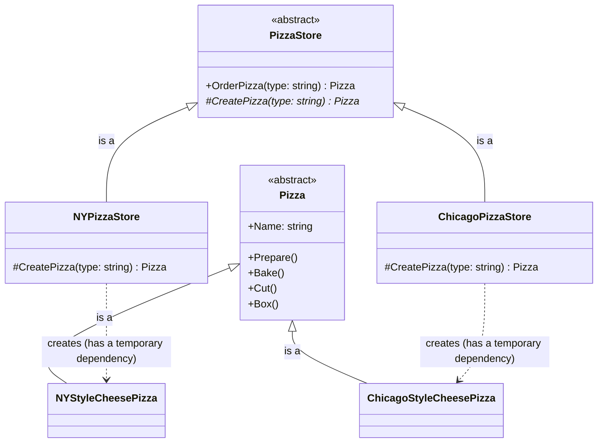
```mermaid
classDiagram
    class PizzaStore {
        <<abstract>>
        +OrderPizza(type: string) Pizza
        #CreatePizza(type: string)* Pizza
    }
    class NYPizzaStore {
        #CreatePizza(type: string) Pizza
    }
    class ChicagoPizzaStore {
        #CreatePizza(type: string) Pizza
    }
    class Pizza {
        <<abstract>>
        +Name: string
        +Prepare()
        +Bake()
        +Cut()
        +Box()
    }
    class NYStyleCheesePizza {
    }
    class ChicagoStyleCheesePizza {
    }

    %% Relații "is a" (Moștenire)
    PizzaStore <|-- NYPizzaStore : is a
    PizzaStore <|-- ChicagoPizzaStore : is a
    Pizza <|-- NYStyleCheesePizza : is a
    Pizza <|-- ChicagoStyleCheesePizza : is a

    %% Relații de dependență/creare
    NYPizzaStore ..> NYStyleCheesePizza : creates (has a temporary dependency)
    ChicagoPizzaStore ..> ChicagoStyleCheesePizza : creates (has a temporary dependency)
```

### 6. Explicația Codului și a Diagramei
* **Clasele utilizate:**
  * `PizzaStore` este clasa **Creatoare Abstractă**. Ea definește algoritmul general de comandă în metoda `OrderPizza`, dar lasă crearea efectivă pe seama metodei abstracte `CreatePizza` (Factory Method).
  * `NYPizzaStore` și `ChicagoPizzaStore` sunt **Creatori Concreți**. Aceștia suprascriu `CreatePizza` pentru a decide ce fel de pizza specifică se instanțiază.
  * `Pizza` este **Produsul Abstract**, iar `NYStyleCheesePizza` / `ChicagoStyleCheesePizza` sunt **Produse Concrete**.
* **Cum funcționează și ce evită:**
  * Relația dintre `PizzaStore` și `Pizza` este una de dependență abstractă. `PizzaStore` nu știe *niciodată* ce clasă concretă de pizza va fi creată.
  * **Fără acest pattern:** În interiorul clasei `PizzaStore` am fi avut un bloc rigid de tipul:
    ```csharp
    if (region == "NY" && type == "cheese") pizza = new NYStyleCheesePizza();
    else if (region == "Chicago" && type == "cheese") pizza = new ChicagoStyleCheesePizza();
    ```
    Acest lucru ar fi legat magazinul direct de rețetele concrete și de regiuni. Prin implementarea Factory Method, decizia este delegată magazinelor regionale, respectând **Dependency Inversion Principle** (ambele categorii de clase depind de abstracții).

---

## 1.2 Abstract Factory (Fabrica Abstractă)

### 1. Definiție
**Abstract Factory** oferă o interfață pentru crearea unor familii de obiecte înrudite sau dependente, fără a specifica clasele lor concrete.

### 2. Ce problemă rezolvă (Ce am folosi fără pattern)
Când un sistem trebuie să lucreze cu diverse familii de produse care trebuie folosite împreună (de exemplu: ingrediente de pizza specifice unei regiuni - aluat subțire cu sos marinara vs aluat gros cu sos de roșii prăjite).
* **Codul fără pattern:** Clientul ar trebui să instanțieze manual fiecare ingredient individual. Am avea cod plin de `if-else` pentru fiecare piesă în parte:
  ```csharp
  Dough dough = (style == "NY") ? new ThinCrustDough() : new ThickCrustDough();
  Sauce sauce = (style == "NY") ? new MarinaraSauce() : new PlumTomatoSauce();
  ```
* **Consecințe negative:** Risc ridicat de a combina ingrediente incompatibile (de exemplu, aluat de Chicago cu sos de New York). Cod extrem de greu de întreținut când se adaugă o nouă familie de ingrediente.

### 3. Avantaje și Dezavantaje (Simple)
* **Avantaje:**
  1. **Garantează compatibilitatea:** Produsele extrase dintr-o fabrică sunt garantate să fie compatibile între ele.
  2. **Izolează clasele concrete:** Clientul nu vede niciodată clasele concrete ale ingredientelor.
  3. **Promovează consistența produselor:** Ușurează schimbarea întregii familii de produse dintr-o singură mișcare la runtime.
* **Dezavantaje:**
  1. **Greu de extins cu noi produse:** Dacă dorim să adăugăm un nou tip de ingredient (ex. `Sauce`), trebuie să modificăm interfața fabricii abstracte și toate implementările ei.
  2. **Complexitate structurală:** Introduce multe interfețe și clase noi (interfețe pentru fiecare tip de ingredient și implementări concrete).
  3. **Nivel dublu de abstractizare:** Poate fi dificil de înțeles de către programatorii juniori.

### 4. Caz de implementare (Head First: Pizza Ingredients)
Vom implementa fabrica de ingrediente pentru a ne asigura că fiecare pizzerie folosește doar ingredientele locale corecte.

```csharp
// --- PRODUSELE ABSTRACTE (Familii de ingrediente) ---
public interface IDough { string GetName(); }
public interface ISauce { string GetName(); }

// --- PRODUSE CONCRETE (Familia New York) ---
public class ThinCrustDough : IDough { public string GetName() => "Aluat cu crustă subțire"; }
public class MarinaraSauce : ISauce { public string GetName() => "Sos Marinara"; }

// --- PRODUSE CONCRETE (Familia Chicago) ---
public class ThickCrustDough : IDough { public string GetName() => "Aluat cu crustă groasă"; }
public class PlumTomatoSauce : ISauce { public string GetName() => "Sos de roșii prăjite"; }

// --- FABRICA ABSTRACTĂ ---
public interface IPizzaIngredientFactory
{
    IDough CreateDough();
    ISauce CreateSauce();
}

// --- FABRICI CONCRETE ---
public class NYPizzaIngredientFactory : IPizzaIngredientFactory
{
    public IDough CreateDough() => new ThinCrustDough();
    public ISauce CreateSauce() => new MarinaraSauce();
}

public class ChicagoPizzaIngredientFactory : IPizzaIngredientFactory
{
    public IDough CreateDough() => new ThickCrustDough();
    public ISauce CreateSauce() => new PlumTomatoSauce();
}

// --- CLIENTUL ---
public class CheesePizza
{
    private readonly IPizzaIngredientFactory _ingredientFactory;
    private IDough _dough;
    private ISauce _sauce;

    public CheesePizza(IPizzaIngredientFactory factory) => _ingredientFactory = factory;

    public void Prepare()
    {
        // Clientul colaborează cu fabrica doar prin interfețe
        _dough = _ingredientFactory.CreateDough();
        _sauce = _ingredientFactory.CreateSauce();
        Console.WriteLine($"Se prepară pizza cu {_dough.GetName()} și {_sauce.GetName()}");
    }
}
```

### 5. Diagrama UML (Relații GoF)

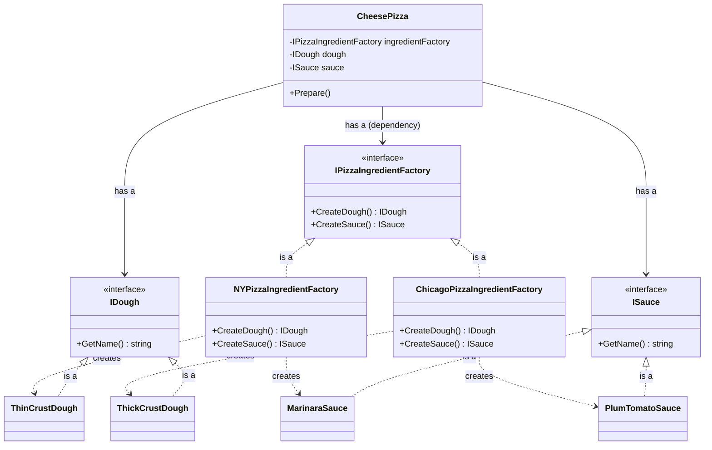
```mermaid
classDiagram
    class IPizzaIngredientFactory {
        <<interface>>
        +CreateDough() IDough
        +CreateSauce() ISauce
    }
    class NYPizzaIngredientFactory {
        +CreateDough() IDough
        +CreateSauce() ISauce
    }
    class ChicagoPizzaIngredientFactory {
        +CreateDough() IDough
        +CreateSauce() ISauce
    }
    class IDough {
        <<interface>>
        +GetName() string
    }
    class ISauce {
        <<interface>>
        +GetName() string
    }
    class ThinCrustDough {
    }
    class ThickCrustDough {
    }
    class MarinaraSauce {
    }
    class PlumTomatoSauce {
    }
    class CheesePizza {
        -IPizzaIngredientFactory ingredientFactory
        -IDough dough
        -ISauce sauce
        +Prepare()
    }

    %% Realizări/Moșteniri ("is a")
    IPizzaIngredientFactory <|.. NYPizzaIngredientFactory : is a
    IPizzaIngredientFactory <|.. ChicagoPizzaIngredientFactory : is a
    IDough <|.. ThinCrustDough : is a
    IDough <|.. ThickCrustDough : is a
    ISauce <|.. MarinaraSauce : is a
    ISauce <|.. PlumTomatoSauce : is a

    %% Relații de asociere/compoziție ("has a")
    CheesePizza --> IPizzaIngredientFactory : has a (dependency)
    CheesePizza --> IDough : has a
    CheesePizza --> ISauce : has a

    %% Relații de instanțiere
    NYPizzaIngredientFactory ..> ThinCrustDough : creates
    NYPizzaIngredientFactory ..> MarinaraSauce : creates
    ChicagoPizzaIngredientFactory ..> ThickCrustDough : creates
    ChicagoPizzaIngredientFactory ..> PlumTomatoSauce : creates
```

### 6. Explicația Codului și a Diagramei
* **Clasele utilizate:**
  * `IPizzaIngredientFactory` reprezintă **Fabrica Abstractă** care declară metodele de creare a produselor abstracte.
  * `NYPizzaIngredientFactory` și `ChicagoPizzaIngredientFactory` sunt **Fabricile Concrete** care implementează metodele și creează ingredientele specifice fiecărei regiuni.
  * `IDough` și `ISauce` sunt **Produsele Abstracte**. Clasele precum `ThinCrustDough` și `MarinaraSauce` sunt **Produsele Concrete**.
  * `CheesePizza` joacă rolul de **Client**.
* **Cum funcționează și ce evită:**
  * Clientul `CheesePizza` deține o referință generică către `IPizzaIngredientFactory` (compoziție/"has a"). Când rulează metoda `Prepare()`, el cere ingredientele fără să știe dacă va primi produse de New York sau Chicago.
  * **Fără acest pattern:** Clientul ar fi conținut logică condițională complexă bazată pe locație și ar fi trebuit să instanțieze direct clase concrete de ingrediente, riscând combinarea eronată a acestora și încălcând grav principiul decuplării.

---

## 1.3 Builder (Constructorul)

### 1. Definiție
**Builder** separă construcția unui obiect complex de reprezentarea sa, astfel încât același proces de construcție să poată crea reprezentări diferite.

### 2. Ce problemă rezolvă (Ce am folosi fără pattern)
Când avem un obiect extrem de complex, cu mulți parametri opționali în constructor (cunoscută ca problema *Constructorului Telescopic*).
* **Codul fără pattern:** Am fi forțați să definim zeci de constructori supraîncărcați cu combinații diferite de parametri opționali sau un singur constructor gigantic:
  ```csharp
  public Pizza(string size, bool cheese, bool pepperoni, bool mushrooms, bool onions) { ... }
  // Apelul devine confuz:
  var pizza = new Pizza("Large", true, false, true, false); 
  ```
* **Consecințe negative:** Citirea codului devine foarte dificilă, riscul de a greși ordinea parametrilor booleeni este uriaș, iar extinderea obiectului cu noi atribute necesită modificarea tuturor constructorilor.

### 3. Avantaje și Dezavantaje (Simple)
* **Avantaje:**
  1. **Elimină constructorii telescopici:** Oferă un mod curat și lizibil de a construi obiecte pas cu pas.
  2. **Interfață Fluentă (Fluent API):** Permite înlănțuirea metodelor (`SetSize().AddCheese().Build()`), sporind considerabil lizibilitatea.
  3. **Control fin asupra procesului:** Obiectul final este extras doar la sfârșitul construcției, asigurându-se că este într-o stare validă.
* **Dezavantaje:**
  1. **Clase suplimentare:** Necesită scrierea unei clase Builder dedicate pentru fiecare clasă complexă.
  2. **Duplicarea codului:** Builderul trebuie să oglindească majoritatea proprietăților din clasa finală.
  3. **Consum suplimentar de memorie:** Instanțierea builderului consumă resurse suplimentare (neglijabil în majoritatea cazurilor).

### 4. Caz de implementare (Classic: Pizza Builder)
Vom folosi exemplul preparării unei Pizza complexe pas cu pas.

```csharp
// --- PRODUSUL ---
public class PizzaProduct
{
    public string Dough { get; set; } = "";
    public string Sauce { get; set; } = "";
    public string Topping { get; set; } = "";

    public void Show() => Console.WriteLine($"Pizza cu aluat: {Dough}, sos: {Sauce}, topping: {Topping}");
}

// --- CONSTRUCTORUL ABSTRACT (Builder) ---
public abstract class PizzaBuilder
{
    protected PizzaProduct pizza = new PizzaProduct();

    public PizzaProduct GetPizza() => pizza;
    public void CreateNewPizza() => pizza = new PizzaProduct();

    public abstract void BuildDough();
    public abstract void BuildSauce();
    public abstract void BuildTopping();
}

// --- CONSTRUCTORI CONCREȚI ---
public class HawaiianPizzaBuilder : PizzaBuilder
{
    public override void BuildDough() => pizza.Dough = "Moale";
    public override void BuildSauce() => pizza.Sauce = "Dulce";
    public override void BuildTopping() => pizza.Topping = "Șuncă + Ananas";
}

public class SpicyPizzaBuilder : PizzaBuilder
{
    public override void BuildDough() => pizza.Dough = "Pufos";
    public override void BuildSauce() => pizza.Sauce = "Iute";
    public override void BuildTopping() => pizza.Topping = "Salam picant + Jalapeno";
}

// --- DIRECTORUL ---
public class WaiterDirector
{
    private PizzaBuilder _pizzaBuilder;

    public void SetPizzaBuilder(PizzaBuilder pb) => _pizzaBuilder = pb;
    public PizzaProduct GetPizza() => _pizzaBuilder.GetPizza();

    public void ConstructPizza()
    {
        _pizzaBuilder.CreateNewPizza();
        _pizzaBuilder.BuildDough();
        _pizzaBuilder.BuildSauce();
        _pizzaBuilder.BuildTopping();
    }
}
```

### 5. Diagrama UML (Relații GoF)

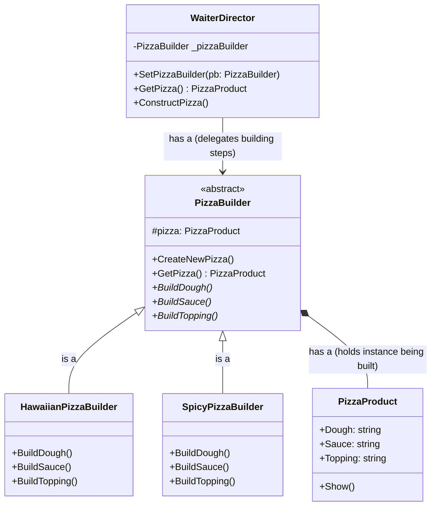
```mermaid
classDiagram
    class WaiterDirector {
        -PizzaBuilder _pizzaBuilder
        +SetPizzaBuilder(pb: PizzaBuilder)
        +GetPizza() PizzaProduct
        +ConstructPizza()
    }
    class PizzaBuilder {
        <<abstract>>
        #pizza: PizzaProduct
        +CreateNewPizza()
        +GetPizza() PizzaProduct
        +BuildDough()*
        +BuildSauce()*
        +BuildTopping()*
    }
    class HawaiianPizzaBuilder {
        +BuildDough()
        +BuildSauce()
        +BuildTopping()
    }
    class SpicyPizzaBuilder {
        +BuildDough()
        +BuildSauce()
        +BuildTopping()
    }
    class PizzaProduct {
        +Dough: string
        +Sauce: string
        +Topping: string
        +Show()
    }

    %% Relații "is a" (Moștenire)
    PizzaBuilder <|-- HawaiianPizzaBuilder : is a
    PizzaBuilder <|-- SpicyPizzaBuilder : is a

    %% Relații "has a" (Asociere/Agregare/Compoziție)
    WaiterDirector --> PizzaBuilder : has a (delegates building steps)
    PizzaBuilder *-- PizzaProduct : has a (holds instance being built)
```

### 6. Explicația Codului și a Diagramei
* **Clasele utilizate:**
  * `PizzaProduct` este **Produsul Complex** pe care vrem să-l construim.
  * `PizzaBuilder` este **Builderul Abstract** care definește interfața comună a pașilor de creare.
  * `HawaiianPizzaBuilder` și `SpicyPizzaBuilder` sunt **Builderii Concreți** care știu cum să prepare o rețetă anume.
  * `WaiterDirector` este **Directorul**. Acesta orchestrează ordinea pașilor (știe algoritmul de asamblare: întâi aluatul, apoi sosul, apoi topping-ul).
* **Cum funcționează și ce evită:**
  * Directorul folosește polimorfismul. El primește orice `PizzaBuilder` și execută pașii în secvență exactă (`BuildDough()`, `BuildSauce()`, `BuildTopping()`).
  * **Fără acest pattern:** Clientul ar fi trebuit să instanțieze clasa `PizzaProduct` și să-i populeze proprietățile manual în codul principal, existând riscul de a uita un pas critic sau de a lăsa obiectul într-o stare inconsistentă.

---

## 1.4 Prototype (Prototipul)

### 1. Definiție
**Prototype** specifică tipurile de obiecte care pot fi create folosind o instanță-prototip și creează obiecte noi prin clonarea acestui prototip.

### 2. Ce problemă rezolvă (Ce am folosi fără pattern)
Când avem nevoie de instanțe noi ale unui obiect care a fost deja configurat anterior sau a cărui creare de la zero prin interogări de baze de date sau procese complexe este extrem de costisitoare.
* **Codul fără pattern:** Am fi forțați să citim din nou datele din sursa externă sau să copiem manual fiecare câmp într-un obiect nou instanțiat cu `new`:
  ```csharp
  var clone = new Document();
  clone.Title = original.Title;
  clone.Content = original.Content; // etc.
  ```
* **Consecințe negative:** Codul devine cuplat de structura internă a clasei (dacă se adaugă un câmp privat, nu îl putem copia din exterior). De asemenea, performanța scade dramatic dacă inițializarea obiectului durează mult.

### 3. Avantaje și Dezavantaje (Simple)
* **Avantaje:**
  1. **Clonare transparentă:** Permite copierea obiectelor fără a cunoaște detaliile claselor lor concrete.
  2. **Optimizarea performanței:** Evită costul mare de inițializare a unui obiect nou (de exemplu, citirea din baza de date).
  3. **Simplifică crearea dinamică:** Putem stoca prototipuri pre-configurate într-un registru și să le clonăm la nevoie.
* **Dezavantaje:**
  1. **Copierea profundă (Deep Copy) este dificilă:** Dacă obiectul conține referințe către alte obiecte sau colecții, clonarea lor corectă (fără a partaja adrese de memorie) poate fi foarte complexă.
  2. **Interfețe circulare:** Obiectele cu referințe circulare sunt extrem de dificil de clonat.
  3. **Implementare invazivă:** Fiecare clasă din ierarhie trebuie să implementeze explicit metoda de clonare.

### 4. Caz de implementare (GoF: Shapes / Graphic Tool)
Vom folosi exemplul clasic de forme geometrice din editorul grafic GoF, unde formele pre-desenate sunt clonate din paletă.

```csharp
// --- INTERFAȚA PROTOTIP ---
public interface IShapePrototype
{
    IShapePrototype Clone(); // Metoda de clonare
    void Draw();
}

// --- PROTOTIPURI CONCRETE ---
public class CirclePrototype : IShapePrototype
{
    private int _radius;
    public string Color { get; set; }

    public CirclePrototype(int radius, string color)
    {
        _radius = radius;
        Color = color;
    }

    // Copierea (Clonarea) profundă
    public IShapePrototype Clone()
    {
        return new CirclePrototype(this._radius, this.Color);
    }

    public void Draw() => Console.WriteLine($"Cerc desenat: rază {_radius}, culoare {Color}");
}

// --- REGISTRUL DE PROTOTIPURI (Paleta de unelte) ---
public class ShapeRegistry
{
    private readonly Dictionary<string, IShapePrototype> _prototypes = new();

    public void AddPrototype(string key, IShapePrototype prototype) => _prototypes[key] = prototype;

    public IShapePrototype GetClone(string key)
    {
        if (_prototypes.ContainsKey(key))
            return _prototypes[key].Clone(); // Întoarce o clonă independentă
        return null;
    }
}
```

### 5. Diagrama UML (Relații GoF)

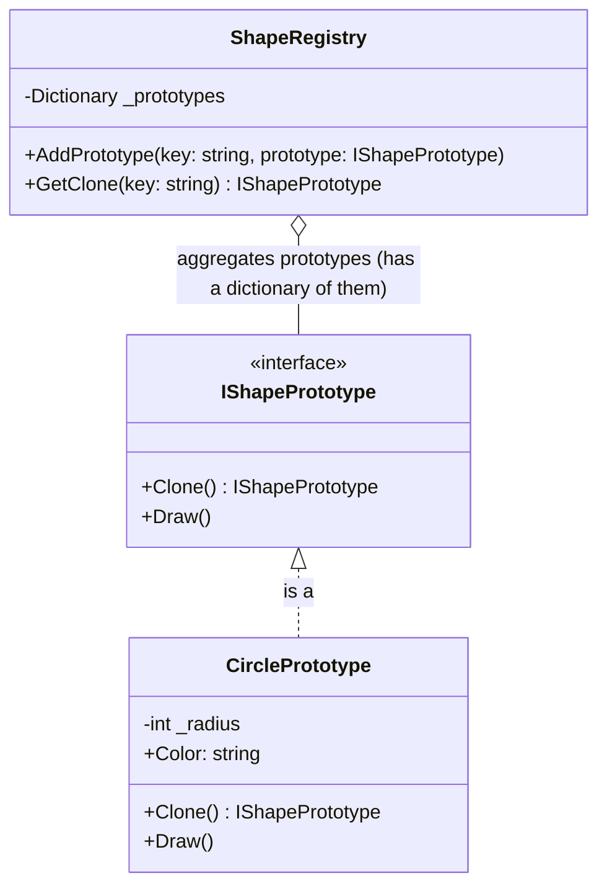
```mermaid
classDiagram
    class IShapePrototype {
        <<interface>>
        +Clone() IShapePrototype
        +Draw()
    }
    class CirclePrototype {
        -int _radius
        +Color: string
        +Clone() IShapePrototype
        +Draw()
    }
    class ShapeRegistry {
        -Dictionary _prototypes
        +AddPrototype(key: string, prototype: IShapePrototype)
        +GetClone(key: string) IShapePrototype
    }

    %% Relații "is a" (Realizare interfață)
    IShapePrototype <|.. CirclePrototype : is a

    %% Relații "has a" (Agregare/Asociare)
    ShapeRegistry o-- IShapePrototype : aggregates prototypes (has a dictionary of them)
```

### 6. Explicația Codului și a Diagramei
* **Clasele utilizate:**
  * `IShapePrototype` definește contractul de clonare (interfața prototipului).
  * `CirclePrototype` este clasa concretă care implementează `Clone()`, returnând o nouă instanță cu valorile curente ale atributelor.
  * `ShapeRegistry` acționează ca o bază de stocare sau "paletă". Acesta păstrează prototipuri gata configurate și le clonează la cerere.
* **Cum funcționează și ce evită:**
  * Clientul solicită registrului un cerc clonat pe baza unei chei text. Registrul returnează o clonă fără ca clientul să știe clasa exactă sau detaliile sale interne.
  * **Fără acest pattern:** Clientul ar fi trebuit să instanțieze manual clasa `CirclePrototype` folosind `new`, furnizând manual toate datele de configurare din nou, ceea ce ar fi expus datele interne (_radius este privat) și ar fi cuplat codul de constructor.

---

# 🧱 CAPITOLUL 2: ȘABLOANE STRUCTURALE

Șabloanele structurale se ocupă de modul în care clasele și obiectele sunt compuse pentru a forma structuri mai mari. Relațiile se bazează pe compoziție în loc de moștenire rigidă.

---

## 2.1 Adapter (Adaptorul)

### 1. Definiție
**Adapter** convertește interfața unei clase într-o altă interfață pe care clienții o așteaptă. Permite claselor cu interfețe incompatibile să lucreze împreună.

### 2. Ce problemă rezolvă (Ce am folosi fără pattern)
Când avem o componentă existentă (ex: o bibliotecă externă) care oferă funcționalitatea dorită, dar metodele sale nu se potrivesc cu interfața curentă a aplicației noastre.
* **Codul fără pattern:** Am fi nevoiți să modificăm clasa externă (imposibil dacă vine ca un pachet compiled tip DLL/NuGet) sau să rescriem codul client pentru a folosi apelurile specifice acelei clase.
* **Consecințe negative:** Cuplare strânsă cu API-uri externe, cod plin de metode duplicat de conversie a datelor împrăștiate peste tot.

### 3. Avantaje și Dezavantaje (Simple)
* **Avantaje:**
  1. **Decuplare ridicată:** Clientul și clasa adaptată sunt complet izolați unul de celălalt.
  2. **Respectă principiul Single Responsibility (SRP):** Logica de conversie este izolată în adaptor.
  3. **Reutilizare ușoară:** Putem reutiliza componente externe incompatibile în mod transparent.
* **Dezavantaje:**
  1. **Crește numărul de clase:** Necesită introducerea de interfețe și clase noi de adaptare.
  2. **Indirecție suplimentară:** Apelurile trec printr-un intermediar, ceea ce poate adăuga o latență microscopică.
  3. **Complexitate generală:** Structura sistemului poate fi greu de înțeles pentru programatorii noi.

### 4. Caz de implementare (Head First: Turkey to Duck Adapter)
Vom folosi exemplul clasic în care vrem să facem un Curcan (Turkey) să se comporte ca o Rață (Duck).

```csharp
// --- INTERFAȚA ȚINTĂ (Așteptată de client) ---
public interface IDuck
{
    void Quack();
    void Fly();
}

// --- CLASA DE ADAPTAT (Adaptee) ---
public interface ITurkey
{
    void Gobble(); // Curcanul face Gobble, nu Quack
    void FlyShortDistance();
}

public class WildTurkey : ITurkey
{
    public void Gobble() => Console.WriteLine("Gobble gobble");
    public void FlyShortDistance() => Console.WriteLine("Zbor pe o distanță scurtă");
}

// --- ADAPTORUL (Implementează Target, deține Adaptee) ---
public class TurkeyAdapter : IDuck
{
    private readonly ITurkey _turkey;

    public TurkeyAdapter(ITurkey turkey) => _turkey = turkey;

    public void Quack()
    {
        _turkey.Gobble(); // Traducem Quack în Gobble
    }

    public void Fly()
    {
        // Compensăm zborul scurt prin repetare
        for (int i = 0; i < 5; i++)
            _turkey.FlyShortDistance();
    }
}
```

### 5. Diagrama UML (Relații GoF)

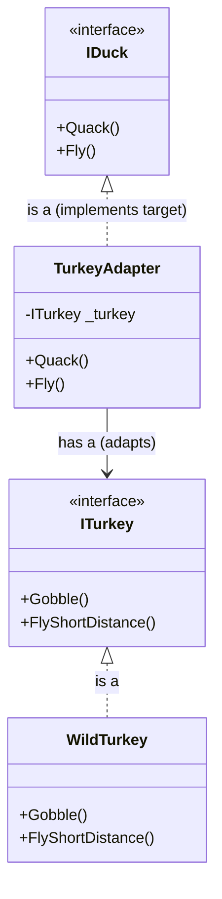
```mermaid
classDiagram
    class IDuck {
        <<interface>>
        +Quack()
        +Fly()
    }
    class ITurkey {
        <<interface>>
        +Gobble()
        +FlyShortDistance()
    }
    class WildTurkey {
        +Gobble()
        +FlyShortDistance()
    }
    class TurkeyAdapter {
        -ITurkey _turkey
        +Quack()
        +Fly()
    }

    %% Relații "is a" (Realizări)
    IDuck <|.. TurkeyAdapter : is a (implements target)
    ITurkey <|.. WildTurkey : is a

    %% Relații "has a" (Compoziție/Asociere - Adaptorul deține Adaptee)
    TurkeyAdapter --> ITurkey : has a (adapts)
```

### 6. Explicația Codului și a Diagramei
* **Clasele utilizate:**
  * `IDuck` este **Interfața Țintă** (Target) pe care clientul o înțelege.
  * `ITurkey` este **Interfața de Adaptat** (Adaptee). Clasa `WildTurkey` este implementarea ei concretă.
  * `TurkeyAdapter` este **Adaptorul Object-level**. El implementează `IDuck` și primește prin constructor o referință la `ITurkey`.
* **Cum funcționează și ce evită:**
  * Când clientul apelează `Quack()`, adaptorul redirecționează intern apelul către `_turkey.Gobble()`.
  * **Fără acest pattern:** Clientul ar fi trebuit rescris complet utilizând blocuri condționale sau apelând direct `Gobble()` în loc de `Quack()`, legând codul de clasa specifică de curcan.

---

## 2.2 Bridge (Puntea)

### 1. Definiție
**Bridge** decuplează o abstracție de implementarea sa, astfel încât cele două să poată varia în mod independent.

### 2. Ce problemă rezolvă (Ce am folosi fără pattern)
Când o clasă variază pe două dimensiuni independente (de exemplu, tipul de Telecomandă și tipul de Televizor).
* **Codul fără pattern:** Moștenirea simplă ar duce la o explozie carteziană de clase: `SonyBasicRemote`, `SonyAdvancedRemote`, `PhilipsBasicRemote`, `PhilipsAdvancedRemote` etc.
* **Consecințe negative:** Cod extrem de rigid și redundant. Orice modificare adusă telecomenzilor de bază trebuie copiată manual în toate implementările specifice brandurilor de TV.

### 3. Avantaje și Dezavantaje (Simple)
* **Avantaje:**
  1. **Evită explozia claselor:** Împarte o ierarhie bidimensională mare în două ierarhii simple independente.
  2. **Respectă principiul Open-Closed (OCP):** Putem adăuga noi telecomenzi sau noi branduri de televizoare fără a le afecta pe celelalte.
  3. **Ascunde detaliile de implementare:** Clientul folosește telecomanda fără a depinde direct de API-ul intern al televizorului.
* **Dezavantaje:**
  1. **Complexitate ridicată:** Structura codului devine mai abstractă și greu de parcurs la o primă vedere.
  2. **Proiectare timpurie obligatorie:** Este foarte greu de refactorizat codul existent pentru a introduce Bridge ulterior.
  3. **Indirecție sporită:** Fiecare operațiune abstractă este delegată printr-o referință internă.

### 4. Caz de implementare (GoF: Remote Control and TV)
Implementăm telecomenzi (Abstracție) ce controlează televizoare (Implementare).

```csharp
// --- IMPLEMENTOR (Interfața internă a dispozitivelor) ---
public interface IDevice
{
    void TurnOn();
    void TurnOff();
    void SetChannel(int channel);
}

// --- CONCRETE IMPLEMENTORS ---
public class SonyTV : IDevice
{
    public void TurnOn() => Console.WriteLine("Sony TV pornit");
    public void TurnOff() => Console.WriteLine("Sony TV oprit");
    public void SetChannel(int channel) => Console.WriteLine($"Sony TV: Canal schimbat la {channel}");
}

public class PhilipsTV : IDevice
{
    public void TurnOn() => Console.WriteLine("Philips TV pornit");
    public void TurnOff() => Console.WriteLine("Philips TV oprit");
    public void SetChannel(int channel) => Console.WriteLine($"Philips TV: Canal schimbat la {channel}");
}

// --- ABSTRACȚIA (Telecomanda generală) ---
public class RemoteControl
{
    protected readonly IDevice device; // Puntea (Bridge) către implementare

    public RemoteControl(IDevice dev) => device = dev;

    public void Power()
    {
        Console.WriteLine("Butonul Power a fost apăsat.");
        device.TurnOn();
    }
}

// --- REFINED ABSTRACTION (Telecomandă avansată) ---
public class AdvancedRemoteControl : RemoteControl
{
    public AdvancedRemoteControl(IDevice dev) : base(dev) { }

    public void Mute() => Console.WriteLine("Dispozitivul a fost pus pe Mute");
    public void ChangeChannel(int ch) => device.SetChannel(ch);
}
```

### 5. Diagrama UML (Relații GoF)

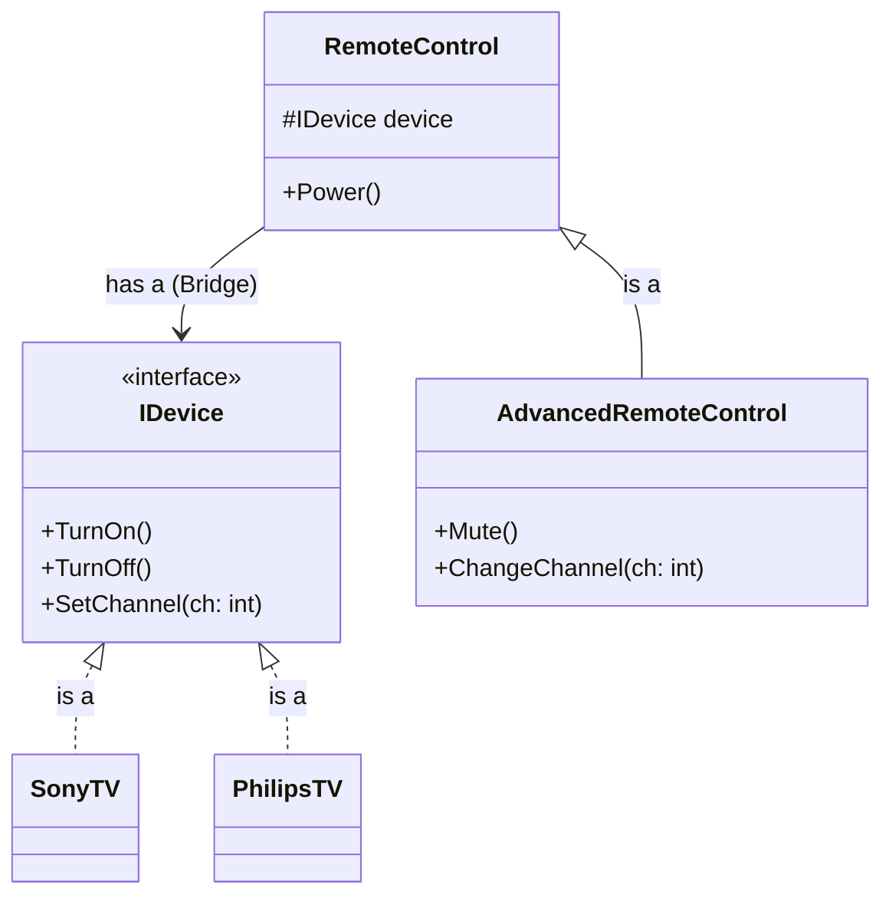
```mermaid
classDiagram
    class IDevice {
        <<interface>>
        +TurnOn()
        +TurnOff()
        +SetChannel(ch: int)
    }
    class SonyTV {
    }
    class PhilipsTV {
    }
    class RemoteControl {
        #IDevice device
        +Power()
    }
    class AdvancedRemoteControl {
        +Mute()
        +ChangeChannel(ch: int)
    }

    %% Relații "is a" (Moșteniri/Realizări)
    IDevice <|.. SonyTV : is a
    IDevice <|.. PhilipsTV : is a
    RemoteControl <|-- AdvancedRemoteControl : is a

    %% Relația Bridge ("has a" - compoziția abstractă de la Abstracție la Implementare)
    RemoteControl --> IDevice : has a (Bridge)
```

### 6. Explicația Codului și a Diagramei
* **Clasele utilizate:**
  * `RemoteControl` este **Abstracția**, iar `AdvancedRemoteControl` este **Abstracția Rafinată**.
  * `IDevice` este **Implementorul (Implementarea de bază)**, iar `SonyTV` și `PhilipsTV` sunt **Implementori Concreți**.
* **Cum funcționează și ce evită:**
  * `RemoteControl` are un câmp protejat `device` de tip `IDevice`. Acesta reprezintă **puntea** (Bridge). Toate metodele din telecomandă sunt delegate polimorfic către acest obiect.
  * **Fără acest pattern:** Pentru a avea o telecomandă avansată pe Sony, am fi fost forțați să moștenim telecomanda și brandul TV simultan: `class AdvancedSonyRemoteControl : SonyTV`. Aceasta creează o cuplare strânsă și imposibilitatea de a folosi aceeași telecomandă pentru Philips.

---

## 2.3 Composite (Compozitul)

### 1. Definiție
**Composite** compune obiectele în structuri arborescente pentru a reprezenta ierarhii parte-întreg. Permite clienților să trateze obiectele individuale și compozițiile de obiecte în mod uniform.

### 2. Ce problemă rezolvă (Ce am folosi fără pattern)
Când avem structuri de tip director-fișier, meniuri cu submeniuri sau pachete de servicii ce conțin alte servicii.
* **Codul fără pattern:** Clienții ar trebui să verifice tipul fiecărui nod la traversare pentru a decide cum să-l proceseze.
  ```csharp
  if (node is Folder) ((Folder)node).ListFiles();
  else if (node is File) ((File)node).PrintName();
  ```
* **Consecințe negative:** Cod plin de instrucțiuni de tip cast, extrem de rigid la modificări și predispus la erori de rulare.

### 3. Avantaje și Dezavantaje (Simple)
* **Avantaje:**
  1. **Polimorfism total (Uniformitate):** Clientul tratează fișierele și directoarele exact la fel, apelând aceeași metodă pe interfața comună.
  2. **Ușor de extins:** Putem adăuga tipuri noi de elemente fără a altera logica clientului.
  3. **Traversare recursivă simplificată:** Algoritmii de parcurgere devin extrem de curați.
* **Dezavantaje:**
  1. **Rigiditate în limitarea tipurilor:** Este dificil de restricționat ca un compozit să accepte doar anumite tipuri de copii la runtime.
  2. **Interfețe prea largi:** Componenta de bază trebuie să declare toate metodele, inclusiv cele de adăugare/ștergere care nu au sens pentru elementele terminale (frunze).
  3. **Dificultate în depanare:** Structurile recursive adânci pot fi greu de investigat în caz de erori.

### 4. Caz de implementare (Head First: Menu & MenuItems)
Modelăm un meniu restaurant cu secțiuni și preparate.

```csharp
// --- COMPONENTA (Interfața comună) ---
public abstract class MenuComponent
{
    public virtual void Add(MenuComponent menuComponent) => throw new NotSupportedException();
    public virtual string GetName() => throw new NotSupportedException();
    public virtual decimal GetPrice() => throw new NotSupportedException();
    public virtual void Print() => throw new NotSupportedException();
}

// --- FRUNZA (Leaf - Obiect individual) ---
public class MenuItem : MenuComponent
{
    private readonly string _name;
    private readonly decimal _price;

    public MenuItem(string name, decimal price)
    {
        _name = name;
        _price = price;
    }

    public override string GetName() => _name;
    public override decimal GetPrice() => _price;
    public override void Print() => Console.WriteLine($" - {GetName()}: {GetPrice()} RON");
}

// --- COMPOZITUL (Colecție de componente) ---
public class Menu : MenuComponent
{
    private readonly List<MenuComponent> _menuComponents = new();
    private readonly string _name;

    public Menu(string name) => _name = name;

    public override void Add(MenuComponent menuComponent) => _menuComponents.Add(menuComponent);
    public override string GetName() => _name;

    public override void Print()
    {
        Console.WriteLine($"\n[MENIU: {GetName()}]");
        foreach (var component in _menuComponents)
        {
            component.Print(); // Apel recursiv polimorfic
        }
    }
}
```

### 5. Diagrama UML (Relații GoF)

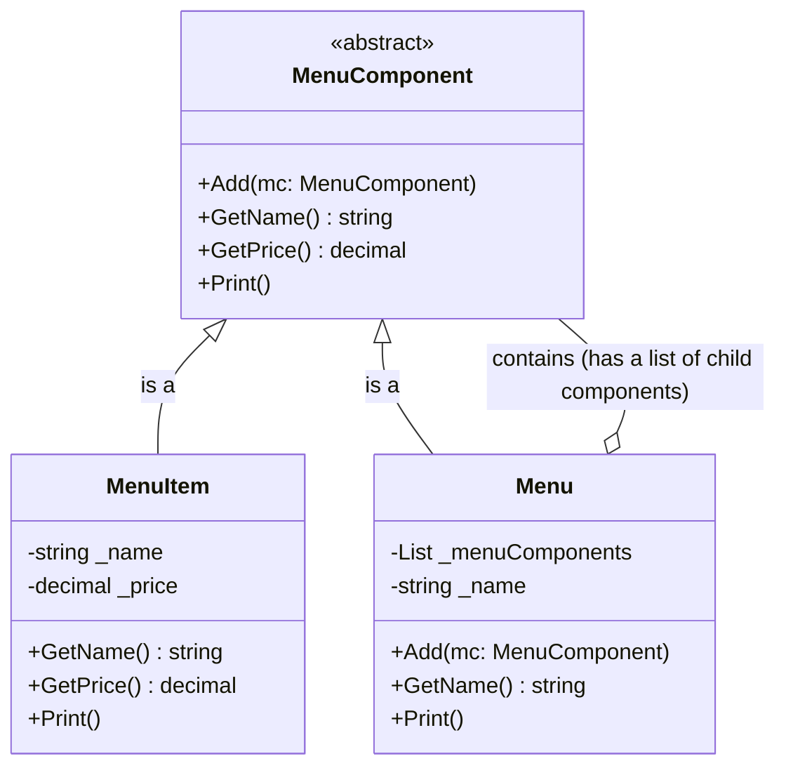
```mermaid
classDiagram
    class MenuComponent {
        <<abstract>>
        +Add(mc: MenuComponent)
        +GetName() string
        +GetPrice() decimal
        +Print()
    }
    class MenuItem {
        -string _name
        -decimal _price
        +GetName() string
        +GetPrice() decimal
        +Print()
    }
    class Menu {
        -List _menuComponents
        -string _name
        +Add(mc: MenuComponent)
        +GetName() string
        +Print()
    }

    %% Relații "is a" (Moșteniri)
    MenuComponent <|-- MenuItem : is a
    MenuComponent <|-- Menu : is a

    %% Relația de agregare recursivă ("has a" - Compozitul conține o colecție de Componente)
    Menu o-- MenuComponent : contains (has a list of child components)
```

### 6. Explicația Codului și a Diagramei
* **Clasele utilizate:**
  * `MenuComponent` este **Componenta Abstractă**. Ea definește operațiunile comune, aruncând erori implicite pentru a preveni operații invalide pe Frunze.
  * `MenuItem` este **Frunza (Leaf)**.
  * `Menu` este **Compozitul**.
* **Cum funcționează și ce evită:**
  * `Menu` deține o colecție de referințe de tipul `MenuComponent`. Când se apelează `Print()`, el iterează peste listă și apelează recursiv `Print()` pe copii, fie că sunt simple preparate sau alte submeniuri întregi.
  * **Fără acest pattern:** Ar fi trebuit să scriem metode separate de afișare pentru felurile de mâncare și pentru grupările de meniuri, folosind bucle imbricate și validări constante de tip, crescând riscul de erori.

---

## 2.4 Decorator (Decoratorul)

### 1. Definiție
**Decorator** atașează responsabilități suplimentare unui obiect în mod dinamic. Decoratorii oferă o alternativă flexibilă la moștenire pentru extinderea funcționalității.

### 2. Ce problemă rezolvă (Ce am folosi fără pattern)
Când vrem să adăugăm ingrediente opționale la o comandă de cafea (lapte, frișcă, sirop, ciocolată) și să calculăm costul final corect.
* **Codul fără pattern:** Am crea câte o clasă pentru fiecare combinație posibilă: `EspressoWithMilk`, `EspressoWithWhip`, `EspressoWithMilkAndWhip` etc.
* **Consecințe negative:** O explozie totală de clase (sute de clase pentru câteva ingrediente) și rigiditate maximă dacă prețul unui ingredient se modifică.

### 3. Avantaje și Dezavantaje (Simple)
* **Avantaje:**
  1. **Extindere dinamică:** Putem decora un obiect la rulare (runtime) cu oricâți decoratori dorim, spre deosebire de moștenire care este statică.
  2. **Respectă principiul Open-Closed (OCP):** Putem scrie noi decoratori fără a modifica componentele de bază.
  3. **Compoziție flexibilă:** Evită clasele monolitice încărcate cu prea multe atribute.
* **Dezavantaje:**
  1. **Multe obiecte mici:** Generează o mulțime de instanțe mici înlănțuite, greu de depanat în stivă.
  2. **Dificultate în configurare:** Procesul de instanțiere prin încapsulare succesivă poate deveni greoi: `new Whip(new Milk(new Espresso()))`.
  3. **Identitatea obiectului:** Obiectul decorat are o referință diferită de cel original, stricând verificările de egalitate directă.

### 4. Caz de implementare (Head First: Starbuzz Coffee)
Vom folosi exemplul clasic în care calculăm prețul băuturilor cu ingrediente adăugate.

```csharp
// --- COMPONENTA ---
public abstract class Beverage
{
    public virtual string Description { get; protected set; } = "Băutură necunoscută";
    public abstract decimal Cost();
}

// --- COMPONENTĂ CONCRETĂ ---
public class Espresso : Beverage
{
    public Espresso() => Description = "Espresso";
    public override decimal Cost() => 7.00m;
}

// --- DECORATORUL DE BAZĂ (Trebuie să extindă Componenta) ---
public abstract class CondimentDecorator : Beverage
{
    protected readonly Beverage beverage; // Referință către obiectul împachetat

    protected CondimentDecorator(Beverage bev) => beverage = bev;
}

// --- DECORATORI CONCREȚI ---
public class Milk : CondimentDecorator
{
    public Milk(Beverage bev) : base(bev) { }

    public override string Description => beverage.Description + ", Lapte";

    public override decimal Cost() => beverage.Cost() + 1.50m; // Adăugăm prețul laptelui
}

public class Whip : CondimentDecorator
{
    public Whip(Beverage bev) : base(bev) { }

    public override string Description => beverage.Description + ", Frișcă";

    public override decimal Cost() => beverage.Cost() + 2.00m;
}
```

### 5. Diagrama UML (Relații GoF)

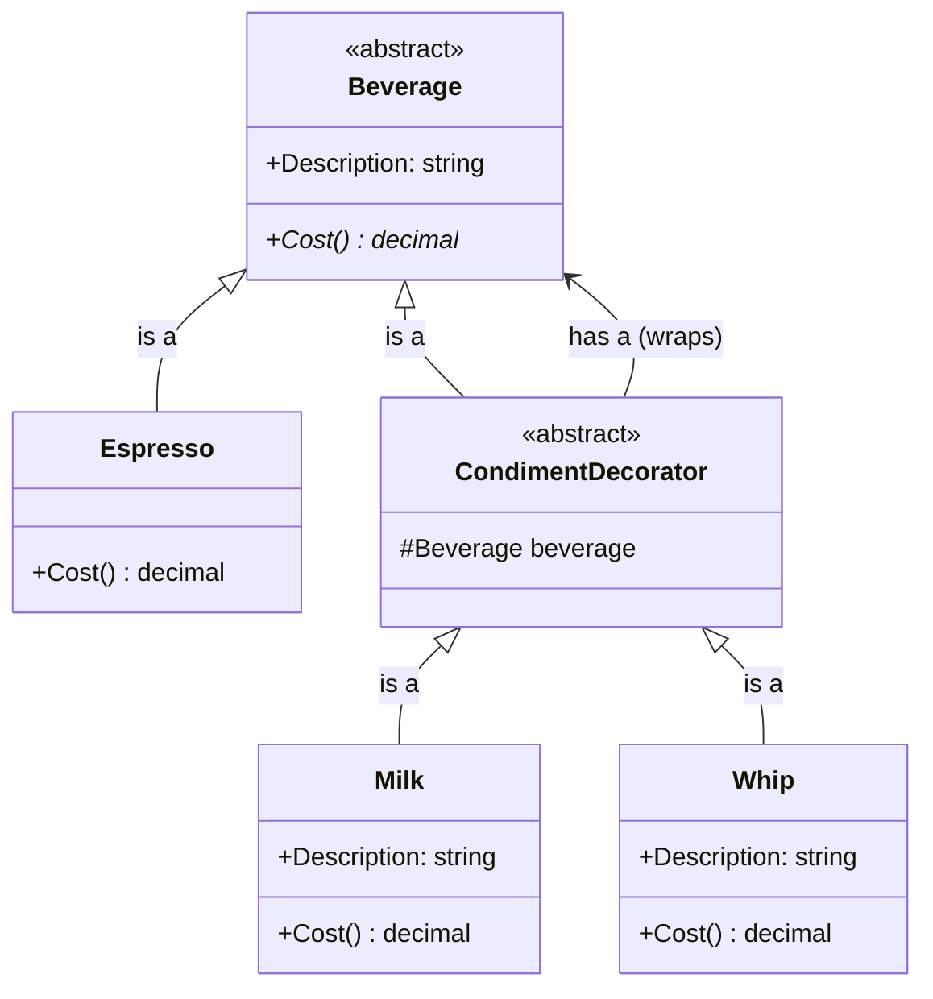
```mermaid
classDiagram
    class Beverage {
        <<abstract>>
        +Description: string
        +Cost()* decimal
    }
    class Espresso {
        +Cost() decimal
    }
    class CondimentDecorator {
        <<abstract>>
        #Beverage beverage
    }
    class Milk {
        +Description: string
        +Cost() decimal
    }
    class Whip {
        +Description: string
        +Cost() decimal
    }

    %% Relații "is a" (Decoratorul ESTE O Componentă pentru a asigura transparența tipului)
    Beverage <|-- Espresso : is a
    Beverage <|-- CondimentDecorator : is a
    CondimentDecorator <|-- Milk : is a
    CondimentDecorator <|-- Whip : is a

    %% Relația "has a" (Decoratorul DEȚINE Componenta pe care o decorează)
    CondimentDecorator --> Beverage : has a (wraps)
```

### 6. Explicația Codului și a Diagramei
* **Clasele utilizate:**
  * `Beverage` este **Componenta Abstractă**.
  * `Espresso` este **Componenta Concretă**.
  * `CondimentDecorator` este **Decoratorul Abstract**. El moștenește `Beverage` (relație "is a") și conține o referință către `Beverage` (relație "has a").
  * `Milk` și `Whip` sunt **Decoratori Concreți**.
* **Cum funcționează și ce evită:**
  * Decoratorii pot fi stivuiți recursiv. Apelul `Cost()` pe ultimul element (ex. `Whip`) va cere prețul obiectului din interior (`Milk.Cost()`), care la rândul său cere costul de bază (`Espresso.Cost()`). Sumele se propagă înapoi pe lanț.
  * **Fără acest pattern:** Pentru fiecare rețetă am fi folosit zeci de atribute booleene (`hasMilk`, `hasWhip`) în clasa de bază `Beverage` sau am fi creat sute de clase derivate rigide, făcând sistemul imposibil de întreținut.

---

## 2.5 Facade (Fațada)

### 1. Definiție
**Facade** oferă o interfață unificată pentru un set de interfețe dintr-un subsistem. Definește o interfață de nivel mai înalt care face subsistemul mai ușor de utilizat.

### 2. Ce problemă rezolvă (Ce am folosi fără pattern)
Când avem un sistem complex compus din numeroase clase independente (un Home Theater cu DVD Player, Proiector, Sistem Audio, Lumini, Ecran) și clientul vrea doar să execute o acțiune simplă precum "Urmărește un film".
* **Codul fără pattern:** Clientul ar trebui să instanțieze și să controleze manual fiecare aparat în parte, apelând zeci de metode în ordinea corectă.
* **Consecințe negative:** Cod extrem de lung, cuplare totală a clientului de toate mecanismele interne ale aparatelor și repetarea aceluiași algoritm de pornire în multiple locuri în aplicație.

### 3. Avantaje și Dezavantaje (Simple)
* **Avantaje:**
  1. **Simplifică utilizarea:** Oferă o singură metodă simplă care ascunde zeci de apeluri de metodă complexe.
  2. **Cuplaj slab (Loose Coupling):** Decuplează codul client de componentele subsistemului.
  3. **Respectă principiul responsabilității unice:** Centralizează controlul fluxului complex într-o singură clasă.
* **Dezavantaje:**
  1. **Risc de a deveni "God Object":** Fațada se poate încărca cu prea multe cunoștințe despre toate clasele din sistem.
  2. **Blochează optimizările avansate:** Clienții care au nevoie de setări specifice ascunse pot fi limitați (deși pot accesa subsistemul direct dacă e nevoie).
  3. **Întreținere continuă:** Orice schimbare în subsisteme forțează modificarea clasei Fațadă.

### 4. Caz de implementare (Head First: Home Theater Facade)
Clasa Fațadă unifică operațiile necesare rulării unui film la cinema-ul de acasă.

```csharp
// --- COMPONENTELE SUBSISTEMULUI COMPLEX ---
public class Amplifier { public void On() => Console.WriteLine("Amplificatorul este Pornit"); public void SetVolume(int v) => Console.WriteLine($"Volum setat la {v}"); }
public class DvdPlayer { public void On() => Console.WriteLine("DVD Player Pornit"); public void Play(string movie) => Console.WriteLine($"Rulează filmul: {movie}"); }
public class Projector { public void On() => Console.WriteLine("Proiector Pornit"); public void WideScreenMode() => Console.WriteLine("Proiector setat pe ecran lat"); }
public class TheaterLights { public void Dim(int percent) => Console.WriteLine($"Lumini setate la {percent}%"); }

// --- FAȚADA ---
public class HomeTheaterFacade
{
    private readonly Amplifier _amp;
    private readonly DvdPlayer _dvd;
    private readonly Projector _projector;
    private readonly TheaterLights _lights;

    public HomeTheaterFacade(Amplifier amp, DvdPlayer dvd, Projector proj, TheaterLights lights)
    {
        _amp = amp;
        _dvd = dvd;
        _projector = proj;
        _lights = lights;
    }

    // Metoda simplificată expusă clientului
    public void WatchMovie(string movie)
    {
        Console.WriteLine("\n--- Pregătim vizionarea filmului... ---");
        _lights.Dim(10);
        _projector.On();
        _projector.WideScreenMode();
        _amp.On();
        _amp.SetVolume(5);
        _dvd.On();
        _dvd.Play(movie);
    }
}
```

### 5. Diagrama UML (Relații GoF)

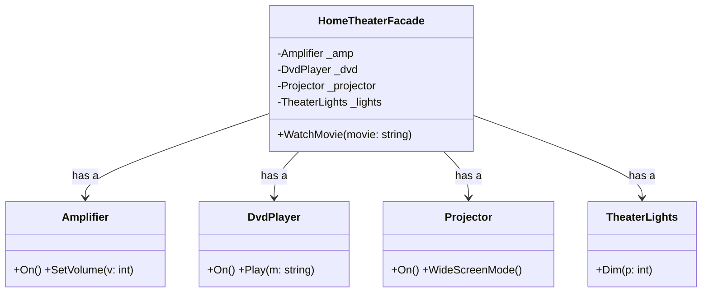
```mermaid
classDiagram
    class HomeTheaterFacade {
        -Amplifier _amp
        -DvdPlayer _dvd
        -Projector _projector
        -TheaterLights _lights
        +WatchMovie(movie: string)
    }
    class Amplifier { +On() +SetVolume(v: int) }
    class DvdPlayer { +On() +Play(m: string) }
    class Projector { +On() +WideScreenMode() }
    class TheaterLights { +Dim(p: int) }

    %% Relații "has a" (Fațada deține referințe către toate subsistemele)
    HomeTheaterFacade --> Amplifier : has a
    HomeTheaterFacade --> DvdPlayer : has a
    HomeTheaterFacade --> Projector : has a
    HomeTheaterFacade --> TheaterLights : has a
```

### 6. Explicația Codului și a Diagramei
* **Clasele utilizate:**
  * `Amplifier`, `DvdPlayer`, `Projector`, `TheaterLights` sunt clasele **subsistemului**.
  * `HomeTheaterFacade` reprezintă **Fațada**.
* **Cum funcționează și ce evită:**
  * Fațada folosește agregarea pentru a grupa componentele. Clientul apelează doar `WatchMovie("Inception")` de pe fațadă, care orchestrează automat secvența corectă.
  * **Fără acest pattern:** Codul din interfața grafică sau din controller ar fi trebuit să apeleze fiecare metodă din cele 4 subsisteme independent, generând un cod greu de citit și duplicat.

---

## 2.6 Flyweight (Flyweight - Greutate pană)

### 1. Definiție
**Flyweight** folosește partajarea (sharing) pentru a sprijini eficient un număr mare de obiecte fine.

### 2. Ce problemă rezolvă (Ce am folosi fără pattern)
Când o aplicație are nevoie de milioane de instanțe ale unui obiect (ex: copaci într-un simulator de pădure sau particule într-un joc video) și memoria RAM este complet epuizată.
* **Codul fără pattern:** Am instanția fiecare copac ca pe o entitate separată, duplicând texturile grele și coordonatele de culoare pentru fiecare poziție (X, Y).
* **Consecințe negative:** Crash-uri frecvente din cauza lipsei de memorie (Out of Memory Exception) și performanță grafică extrem de slabă.

### 3. Avantaje și Dezavantaje (Simple)
* **Avantaje:**
  1. **Economie uriașă de memorie RAM:** Datele partajate (intrinseci) sunt stocate o singură dată în memorie.
  2. **Instanțiere rapidă:** Copacii individuali devin doar referințe subțiri.
  3. **Structură centralizată:** Datele grele sunt gestionate într-un cache dedicat.
* **Dezavantaje:**
  1. **Complexitate algoritmică:** Împărțirea stării în date intrinseci și extrinseci face codul mai greu de citit.
  2. **Timp de procesare CPU:** Extragerea continuă a stărilor extrinseci la randare consumă cicluri CPU suplimentare.
  3. **Threading issues:** Datele partajate din Flyweight trebuie să fie imutabile (read-only) pentru a evita modificări neintenționate.

### 4. Caz de implementare (GoF: Forest Tree Rendering)
Împărțim starea unui copac în date grele partajate (nume, textură) și date ușoare unice (coordonate X, Y).

```csharp
// --- FLYWEIGHT (Stare Intrinsecă - Partajată, Imutabilă) ---
public class TreeType
{
    public string Name { get; }
    public string Color { get; }
    public string TextureData { get; } // Fișier greu de textură în realitate

    public TreeType(string name, string color, string texture)
    {
        Name = name;
        Color = color;
        TextureData = texture;
    }

    public void Render(int x, int y)
    {
        // Randăm folosind datele grele interne și coordonatele externe
        Console.WriteLine($"Copac '{Name}' ({Color}) randat la poziția [{x}, {y}]");
    }
}

// --- FLYWEIGHT FACTORY (Asigură cache-ul și partajarea) ---
public class TreeFactory
{
    private static readonly Dictionary<string, TreeType> _treeTypes = new();

    public static TreeType GetTreeType(string name, string color, string texture)
    {
        string key = $"{name}_{color}";
        if (!_treeTypes.ContainsKey(key))
        {
            _treeTypes[key] = new TreeType(name, color, texture);
            Console.WriteLine($"[CACHE] Am creat un nou tip de copac: {key}");
        }
        return _treeTypes[key];
    }
}

// --- CONTEXTUL (Deține Starea Extrinsecă - Coordonate unice) ---
public class Tree
{
    private readonly int _x;
    private readonly int _y;
    private readonly TreeType _type; // Referință către Flyweight

    public Tree(int x, int y, TreeType type)
    {
        _x = x;
        _y = y;
        _type = type;
    }

    public void Draw() => _type.Render(_x, _y);
}
```

### 5. Diagrama UML (Relații GoF)

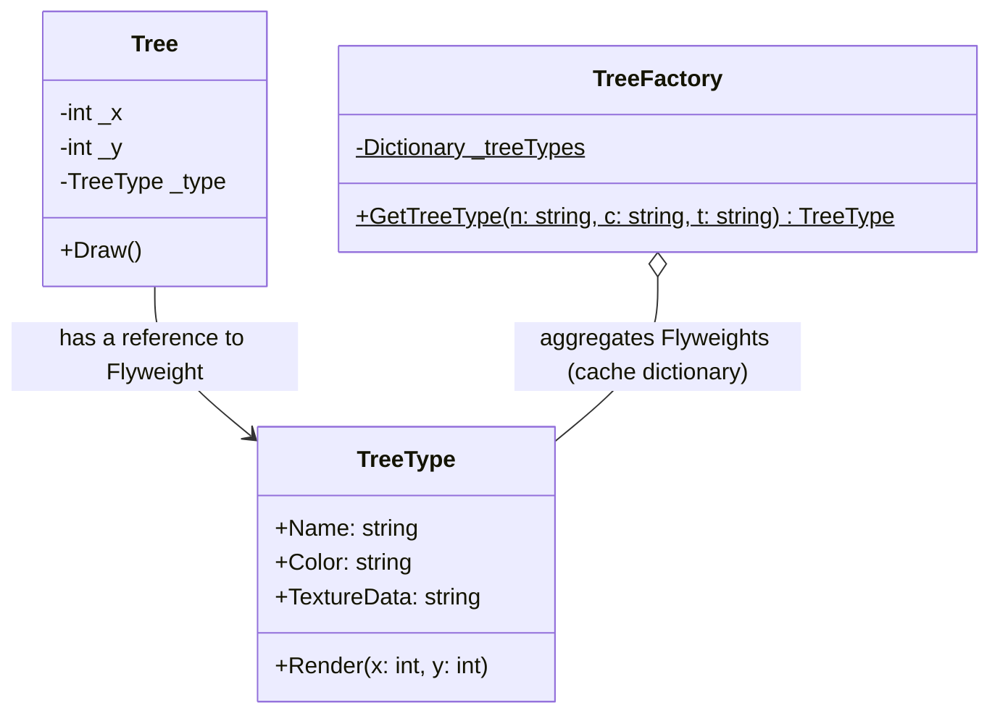
```mermaid
classDiagram
    class TreeType {
        +Name: string
        +Color: string
        +TextureData: string
        +Render(x: int, y: int)
    }
    class TreeFactory {
        -Dictionary _treeTypes$
        +GetTreeType(n: string, c: string, t: string)$ TreeType
    }
    class Tree {
        -int _x
        -int _y
        -TreeType _type
        +Draw()
    }

    %% Relații "has a" (Compoziție/Asociere)
    Tree --> TreeType : has a reference to Flyweight
    TreeFactory o-- TreeType : aggregates Flyweights (cache dictionary)
```

### 6. Explicația Codului și a Diagramei
* **Clasele utilizate:**
  * `TreeType` este clasa **Flyweight**. Conține starea **intrinsecă** (datele grele ce nu se schimbă de la copac la copac: culoare, textură).
  * `TreeFactory` este **Fabrica Flyweight**. Gestionează colecția statică de referințe.
  * `Tree` este clasa **Context**. Ea conține starea **extrinsecă** (poziția X, Y - diferită pentru fiecare copac în pădure).
* **Cum funcționează și ce evită:**
  * În loc să avem 1.000.000 de obiecte grele cu texturi în memorie, avem doar 3 instanțe `TreeType` în cache și 1.000.000 de instanțe ușoare de tipul `Tree` (care stochează doar 2 întregi și o referință la tip).
  * **Fără acest pattern:** Fiecare copac ar fi conținut direct proprietatea grea `TextureData` (de ex. 5MB pe instanță), ducând la un consum de memorie uriaș de 5 Terabytes în loc de câțiva Megabytes.

---

## 2.7 Proxy (Procuratorul / Substitutul)

### 1. Definiție
**Proxy** oferă un substitut sau un marker de poziție pentru un alt obiect pentru a-i controla accesul.

### 2. Ce problemă rezolvă (Ce am folosi fără pattern)
Când accesul la un obiect este costisitor (ex. necesită timp de încărcare din rețea) sau trebuie controlat din motive de securitate (filtrarea site-urilor web).
* **Codul fără pattern:** Clientul ar apela direct resursa mare sau nesigură.
* **Consecințe negative:** Încărcări blocate ale interfeței grafice în timp ce se încarcă imagini din fundal și breșe grave de securitate, permițând accesul neautorizat la metode sensibile.

### 3. Avantaje și Dezavantaje (Simple)
* **Avantaje:**
  1. **Securitate sporită (Protection Proxy):** Interceptează cererile și validează drepturile înainte de a contacta obiectul real.
  2. **Încărcare leneșă (Virtual Proxy):** Amână crearea obiectului costisitor până când este cu adevărat nevoie de el.
  3. **Transparență totală:** Proxy-ul și obiectul real implementează aceeași interfață, clientul neștiind diferența.
* **Dezavantaje:**
  1. **Indirecție suplimentară:** Întârzie ușor răspunsul din cauza verificărilor suplimentare.
  2. **Complexitate crescută:** Necesită cod adițional pentru controlul ciclului de viață al obiectului real.
  3. **Risc de desincronizare:** Stările dintre proxy și obiectul real pot diferi dacă nu sunt sincronizate cu atenție.

### 4. Caz de implementare (Head First: Protection / Virtual Internet Proxy)
Vom implementa un proxy de securitate pentru acces la internet care blochează site-urile interzise.

```csharp
// --- SUBIECTUL (Interfața comună) ---
public interface IInternet
{
    void ConnectTo(string serverHost);
}

// --- SUBIECTUL REAL (Real Subject) ---
public class RealInternet : IInternet
{
    public void ConnectTo(string serverHost)
    {
        Console.WriteLine($"Conexiune reușită la serverul: {serverHost}");
    }
}

// --- PROXY-UL (Deține referința la Real Subject și controlează accesul) ---
public class ProxyInternet : IInternet
{
    private readonly IInternet _realInternet = new RealInternet();
    private static readonly List<string> BannedSites = new();

    static ProxyInternet()
    {
        BannedSites.Add("facebook.com");
        BannedSites.Add("instagram.com");
    }

    public void ConnectTo(string serverHost)
    {
        // Logica de control a accesului (Filtrare)
        if (BannedSites.Contains(serverHost.ToLower()))
        {
            Console.WriteLine($"[BLOCAT]: Acces refuzat la {serverHost}!");
            return;
        }

        // Delegare către obiectul real
        _realInternet.ConnectTo(serverHost);
    }
}
```

### 5. Diagrama UML (Relații GoF)

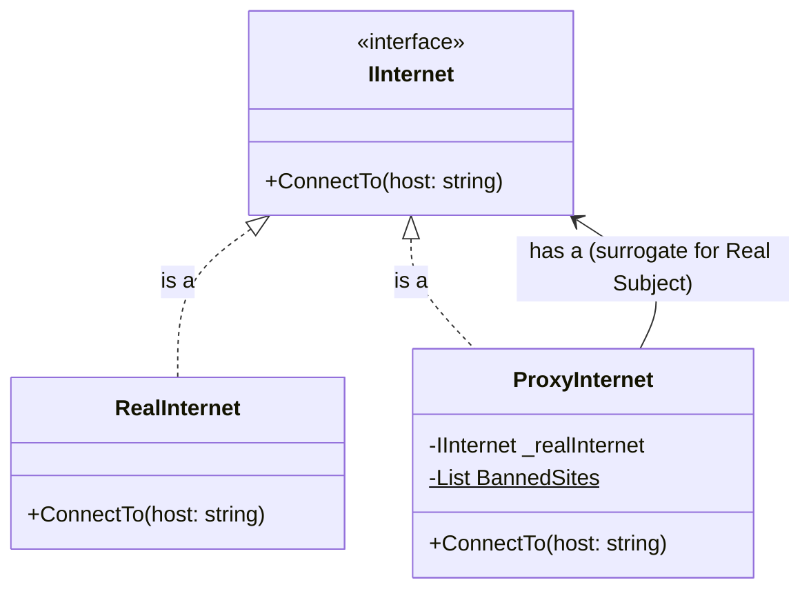
```mermaid
classDiagram
    class IInternet {
        <<interface>>
        +ConnectTo(host: string)
    }
    class RealInternet {
        +ConnectTo(host: string)
    }
    class ProxyInternet {
        -IInternet _realInternet
        -List BannedSites$
        +ConnectTo(host: string)
    }

    %% Relații "is a" (Ambele implementează subiectul de bază)
    IInternet <|.. RealInternet : is a
    IInternet <|.. ProxyInternet : is a

    %% Relația "has a" (Proxy-ul deține/compune subiectul real)
    ProxyInternet --> IInternet : has a (surrogate for Real Subject)
```

### 6. Explicația Codului și a Diagramei
* **Clasele utilizate:**
  * `IInternet` este **Subiectul Abstract** (Subject) care definește operațiile comune.
  * `RealInternet` este **Subiectul Real** (Real Subject).
  * `ProxyInternet` este **Proxy-ul (Protection Proxy)**.
* **Cum funcționează și ce evită:**
  * Clientul folosește `IInternet`. La rulare, el primește o instanță de `ProxyInternet`. Când apelează `ConnectTo("facebook.com")`, proxy-ul interceptează apelul, verifică lista neagră și oprește execuția înainte ca clasa reală de conexiune să fie instanțiată sau apelată.
  * **Fără acest pattern:** Logica de filtrare a securității ar fi fost plasată direct în clasa `RealInternet`, poluând codul de conexiune cu reguli specifice de securitate și încălcând principiul responsabilității unice.

---

# ⚙️ CAPITOLUL 3: ȘABLOANE COMPORTAMENTALE

Șabloanele comportamentale se concentrează pe algoritmi și pe împărțirea responsabilităților între obiecte, optimizând fluxul de comunicare la rulare.

---

## 3.1 Strategy (Strategia)

### 1. Definiție
**Strategy** definește o familie de algoritmi, încapsulează pe fiecare în parte și îi face interschimbabili. Permite algoritmului să varieze independent de clienții care îl folosesc.

### 2. Ce problemă rezolvă (Ce am folosi fără pattern)
Când un obiect trebuie să ruleze un algoritm diferit în funcție de starea sa curentă sau de un parametru la runtime (de exemplu, tipurile de zbor și de sunete ale rațelor).
* **Codul fără pattern:** Am folosi moștenirea simplă pentru a defini comportamentele. Dar rațele de plastic care nu zboară ar moșteni metoda `Fly()` de la clasa de bază `Duck`.
* **Consecințe negative:** Cod duplicat la nivel de clase derivate, metode goale sau excepții aruncate de tipul `NotImplementedException` pentru comportamente care nu se aplică, și rigiditate maximă la runtime.

### 3. Avantaje și Dezavantaje (Simple)
* **Avantaje:**
  1. **Evită moștenirea rigidă:** Permite modificarea comportamentului unui obiect la rulare prin compoziție.
  2. **Elimină if-else/switch:** Scapă de blocurile condiționale mari utilizate pentru a alege un algoritm.
  3. **Respectă principiul Open-Closed (OCP):** Putem introduce noi strategii fără a atinge clasa client.
* **Dezavantaje:**
  1. **Număr mare de clase:** Fiecare algoritm nou necesită crearea unei clase distincte.
  2. **Clientul trebuie să știe diferența:** Codul client trebuie să înțeleagă detaliile strategiilor pentru a o alege pe cea corectă la inițializare.
  3. **Comunicare suplimentară:** Strategiile și contextul pot avea nevoie de interfețe de comunicare mari, crescând overhead-ul.

### 4. Caz de implementare (Head First: Duck Simulator)
Implementăm rațe care își pot schimba dinamic modul de zbor.

```csharp
// --- STRATEGIA (Interfața comportamentului) ---
public interface IFlyBehavior
{
    void Fly();
}

// --- STRATEGII CONCRETE ---
public class FlyWithWings : IFlyBehavior
{
    public void Fly() => Console.WriteLine("Zbor dând din aripi!");
}

public class FlyNoWay : IFlyBehavior
{
    public void Fly() => Console.WriteLine("Nu pot zbura.");
}

// --- CONTEXTUL (Clasa client) ---
public abstract class Duck
{
    protected IFlyBehavior flyBehavior; // Strategia compusă (has a)

    public void SetFlyBehavior(IFlyBehavior fb) => flyBehavior = fb; // Permite runtime-change

    public void PerformFly() => flyBehavior.Fly(); // Delegare polimorfică

    public void Swim() => Console.WriteLine("Toate rațele plutesc.");
}

// --- CONTEXT CONCRET ---
public class MallardDuck : Duck
{
    public MallardDuck()
    {
        flyBehavior = new FlyWithWings(); // Comportament implicit
    }
}
```

### 5. Diagrama UML (Relații GoF)

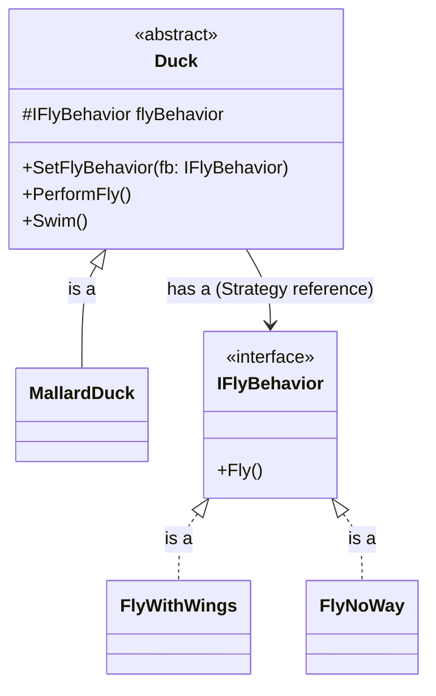
```mermaid
classDiagram
    class Duck {
        <<abstract>>
        #IFlyBehavior flyBehavior
        +SetFlyBehavior(fb: IFlyBehavior)
        +PerformFly()
        +Swim()
    }
    class MallardDuck {
    }
    class IFlyBehavior {
        <<interface>>
        +Fly()
    }
    class FlyWithWings {
    }
    class FlyNoWay {
    }

    %% Relații "is a" (Moșteniri)
    Duck <|-- MallardDuck : is a
    IFlyBehavior <|.. FlyWithWings : is a
    IFlyBehavior <|.. FlyNoWay : is a

    %% Relația "has a" (Contextul deține o referință către Strategie - Compoziție)
    Duck --> IFlyBehavior : has a (Strategy reference)
```

### 6. Explicația Codului și a Diagramei
* **Clasele utilizate:**
  * `Duck` este **Contextul**, iar `MallardDuck` este un **Context Concret**.
  * `IFlyBehavior` este **Strategia Abstractă**.
  * `FlyWithWings` și `FlyNoWay` sunt **Strategiile Concrete**.
* **Cum funcționează și ce evită:**
  * Contextul `Duck` conține referința `flyBehavior`. Apelând `PerformFly()`, el deleagă responsabilitatea către strategia curentă. La runtime putem apela `SetFlyBehavior(new FlyNoWay())` pentru a schimba instant zborul.
  * **Fără acest pattern:** Metoda `Fly` ar fi fost în clasa de bază `Duck`, forțând clasa `RubberDuck` (rața de cauciuc) să suprascrie și să lase metoda goală sau să arunce erori, riscând bug-uri majore.

---

## 3.2 Observer (Observatorul)

### 1. Definiție
**Observer** definește o dependență unu-la-mulți între obiecte, astfel încât atunci când un obiect își schimbă starea, toți dependenții săi sunt notificați și actualizați automat.

### 2. Ce problemă rezolvă (Ce am folosi fără pattern)
Când avem un ecran sau mai multe widget-uri care trebuie să afișeze date în timp real de la o stație meteo.
* **Codul fără pattern:** Ecranul ar trebui să ruleze o buclă continuă (polling) întrebând stația meteo "S-au schimbat datele?".
* **Consecințe negative:** Consum masiv și inutil de resurse CPU pentru interogări repetate, latență mare în afișare și cuplare strânsă între sursa de date și afișaj.

### 3. Avantaje și Dezavantaje (Simple)
* **Avantaje:**
  1. **Decuplare maximă:** Subiectul nu are nevoie să știe detaliile claselor observatorilor.
  2. **Actualizări automate:** Datele sunt transmise automat (Push) instantaneu la modificare.
  3. **Conexiuni dinamice:** Observatorii se pot abona sau dezabona oricând la runtime.
* **Dezavantaje:**
  1. **Notificări neașteptate:** Un singur update poate declanșa o avalanșă de reacții în lanț nedorite.
  2. **Scurgeri de memorie:** Dacă un observator nu se dezabonează înainte de a fi distrus, Subiectul va păstra o referință vie la el, împiedicând colectarea de gunoi (Garbage Collection).
  3. **Lipsa detaliilor:** Observatorii primesc doar semnalul general, fiind nevoiți uneori să facă interogări suplimentare.

### 4. Caz de implementare (Head First: Weather Station)
Vom folosi exemplul clasic în care o stație meteo notifică panourile de afișaj.

```csharp
// --- OBSERVATORUL (Interfața) ---
public interface IObserver
{
    void Update(float temp, float humidity);
}

// --- SUBIECTUL (Observable) ---
public interface ISubject
{
    void RegisterObserver(IObserver o);
    void RemoveObserver(IObserver o);
    void NotifyObservers();
}

// --- SUBIECTUL CONCRET ---
public class WeatherData : ISubject
{
    private readonly List<IObserver> _observers = new();
    private float _temperature;
    private float _humidity;

    public void RegisterObserver(IObserver o) => _observers.Add(o);
    public void RemoveObserver(IObserver o) => _observers.Remove(o);

    public void NotifyObservers()
    {
        foreach (var observer in _observers)
            observer.Update(_temperature, _humidity); // Trimite datele
    }

    public void SetMeasurements(float temp, float hum)
    {
        _temperature = temp;
        _humidity = hum;
        NotifyObservers(); // Declanșează automat notificările
    }
}

// --- OBSERVATOR CONCRET ---
public class CurrentConditionsDisplay : IObserver
{
    public void Update(float temp, float humidity)
    {
        Console.WriteLine($"[Afișaj] Condiții curente: {temp}°C și {humidity}% umiditate.");
    }
}
```

### 5. Diagrama UML (Relații GoF)

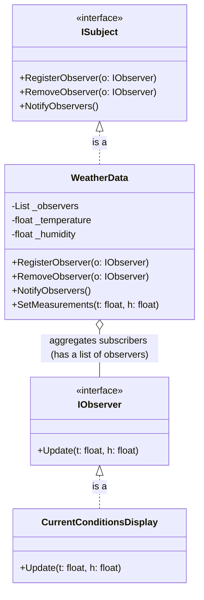
```mermaid
classDiagram
    class ISubject {
        <<interface>>
        +RegisterObserver(o: IObserver)
        +RemoveObserver(o: IObserver)
        +NotifyObservers()
    }
    class WeatherData {
        -List _observers
        -float _temperature
        -float _humidity
        +RegisterObserver(o: IObserver)
        +RemoveObserver(o: IObserver)
        +NotifyObservers()
        +SetMeasurements(t: float, h: float)
    }
    class IObserver {
        <<interface>>
        +Update(t: float, h: float)
    }
    class CurrentConditionsDisplay {
        +Update(t: float, h: float)
    }

    %% Relații "is a" (Realizări)
    ISubject <|.. WeatherData : is a
    IObserver <|.. CurrentConditionsDisplay : is a

    %% Relația "has a" (Subiectul conține/agregă o listă de Observatori)
    WeatherData o-- IObserver : aggregates subscribers (has a list of observers)
```

### 6. Explicația Codului și a Diagramei
* **Clasele utilizate:**
  * `ISubject` definește mecanismul de abonare. `WeatherData` este **Subiectul Concret**.
  * `IObserver` reprezintă **Observatorul**. `CurrentConditionsDisplay` este **Observatorul Concret**.
* **Cum funcționează și ce evită:**
  * Când temperatura se modifică prin `SetMeasurements`, subiectul apelează polimorfic metoda `Update()` pentru fiecare element din colecția `_observers`.
  * **Fără acest pattern:** Clasa `WeatherData` ar fi trebuit să aibă apeluri rigide către ecrane concrete:
    ```csharp
    currentDisplay.Update(t, h);
    statisticsDisplay.Update(t, h); // Cod strâns cuplat și rigid!
    ```

---

## 3.3 Command (Comanda)

### 1. Definiție
**Command** încapsulează o cerere ca un obiect, permițându-vă astfel să parametrizați clienții cu diferite cereri, să puneți cereri în coadă sau să le înregistrați și să asigurați operații de anulare (Undo).

### 2. Ce problemă rezolvă (Ce am folosi fără pattern)
Când avem o telecomandă universală cu butoane configurabile și vrem să asociem fiecărui buton câte o acțiune pe diverse dispozitive (bec, radio, ușă).
* **Codul fără pattern:** Butoanele telecomenzii ar trebui să aibă legături strânse cu aparatele reale:
  ```csharp
  if (buttonPressed == 1) _light.TurnOn();
  else if (buttonPressed == 2) _stereo.PlayCD();
  ```
* **Consecințe negative:** Telecomanda ar deveni dependentă direct de toate clasele de electronice din casă. Adăugarea unui nou aparat ar necesita rescrierea totală a codului telecomenzii.

### 3. Avantaje și Dezavantaje (Simple)
* **Avantaje:**
  1. **Decuplează Invoker-ul de Receiver:** Telecomanda nu știe *cine* execută acțiunea sau ce face aceasta.
  2. **Suport nativ pentru Undo/Redo:** Încapsularea acțiunii ca obiect permite stocarea ei într-o stivă pentru anulare.
  3. **Comenzi Compuse (Macro):** Putem grupa mai multe comenzi într-o singură listă executabilă secvențial.
* **Dezavantaje:**
  1. **Multe clase de comenzi:** Trebuie creată o clasă separată pentru fiecare acțiune minoră (ex. `LightOnCommand`, `LightOffCommand`).
  2. **Cod de legătură extins:** Se adaugă un nivel de indirectare care sporește volumul de fișiere scrise.
  3. **Complexitatea stării de Undo:** Salvarea stărilor anterioare ale obiectelor poate fi mare consumatoare de memorie.

### 4. Caz de implementare (Head First: Simple Remote Control)
Implementăm butoane care controlează lumina din casă.

```csharp
// --- INTERFAȚA COMANDĂ ---
public interface ICommand
{
    void Execute();
    void Undo();
}

// --- DISPOZITIVUL FINAL (Receiver - Cel care știe logica reală) ---
public class Light
{
    public void On() => Console.WriteLine("Lumina este aprinsă");
    public void Off() => Console.WriteLine("Lumina este stinsă");
}

// --- COMENZI CONCRETE ---
public class LightOnCommand : ICommand
{
    private readonly Light _light; // Receiver-ul asociat

    public LightOnCommand(Light light) => _light = light;

    public void Execute() => _light.On();
    public void Undo() => _light.Off(); // Anularea aprinderii este stingerea
}

// --- INVOKER (Telecomanda - Declanșatorul) ---
public class SimpleRemoteControl
{
    private ICommand _slot; // Slotul butonului curent

    public void SetCommand(ICommand command) => _slot = command;

    public void PressButton() => _slot.Execute();
}
```

### 5. Diagrama UML (Relații GoF)

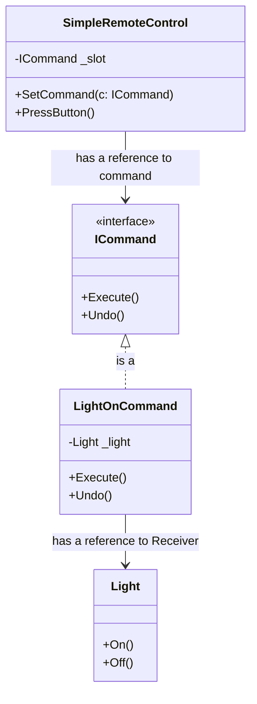
```mermaid
classDiagram
    class ICommand {
        <<interface>>
        +Execute()
        +Undo()
    }
    class LightOnCommand {
        -Light _light
        +Execute()
        +Undo()
    }
    class Light {
        +On()
        +Off()
    }
    class SimpleRemoteControl {
        -ICommand _slot
        +SetCommand(c: ICommand)
        +PressButton()
    }

    %% Relații "is a" (Realizări)
    ICommand <|.. LightOnCommand : is a

    %% Relații "has a" (Asocieri/Agregări)
    SimpleRemoteControl --> ICommand : has a reference to command
    LightOnCommand --> Light : has a reference to Receiver
```

### 6. Explicația Codului și a Diagramei
* **Clasele utilizate:**
  * `ICommand` este **Comanda Abstractă**.
  * `LightOnCommand` este **Comanda Concretă**.
  * `Light` este **Receiver-ul (Receptorul)**.
  * `SimpleRemoteControl` este **Invoker-ul (Apelantul)**.
* **Cum funcționează și ce evită:**
  * Invokerul apelează doar metoda generică `Execute()`. Relația dintre comandă și receptor (`Light`) garantează că acțiunea corectă va fi trimisă aparatului corect în mod transparent.
  * **Fără acest pattern:** Telecomanda ar fi trebuit să conțină direct o instanță de tipul `Light` și să invoce explicit `_light.On()`, blocând utilizarea telecomenzii pentru orice alt aparat precum aerul condiționat.

---

## 3.4 State (Starea)

### 1. Definiție
**State** permite unui obiect să își modifice comportamentul atunci când starea sa internă se schimbă. Obiectul va părea că își schimbă clasa.

### 2. Ce problemă rezolvă (Ce am folosi fără pattern)
Când avem un automat de vânzare (Gumball Machine) care acționează complet diferit la introducerea unei fise în funcție de starea curentă (Fără fisă, Are fisă, Gume epuizate, Guma vândută).
* **Codul fără pattern:** Am defini variabile intregi (constante) pentru stări și am umple fiecare metodă (`InsertQuarter()`, `TurnCrank()`) de zeci de blocuri imbricate `if-else`.
* **Consecințe negative:** Codul devine o "supă de spaghete" extrem de greu de testat și de extins. O nouă stare ar presupune modificarea fiecărei metode din automat.

### 3. Avantaje și Dezavantaje (Simple)
* **Avantaje:**
  1. **Elimină if-else masiv:** Repartizează comportamentul specific stării în clase dedicate.
  2. **Respectă Single Responsibility (SRP):** Logica fiecărei stări este complet izolată.
  3. **Tranziții explicite:** Facilitează înțelegerea modului în care automatul comută între stări.
* **Dezavantaje:**
  1. **Explozia claselor:** Necesită clase separate pentru fiecare stare individuală din diagramă.
  2. **Cuplare între stări:** Adesea stările trebuie să se cunoască între ele pentru a declanșa tranzițiile, creând dependențe ciclice.
  3. **Greu de urmărit:** Fluxul execuției sare constant de la o clasă de stare la alta la rulare.

### 4. Caz de implementare (Head First: Gumball Machine)
Modelăm tranzacțiile unui tonomat cu gume de mestecat.

```csharp
// --- INTERFAȚA STARE ---
public interface IState
{
    void InsertQuarter();
    void EjectQuarter();
    void TurnCrank();
}

// --- CONTEXT (Automatul de gume) ---
public class GumballMachine
{
    public IState NoQuarterState { get; }
    public IState HasQuarterState { get; }

    public IState CurrentState { get; private set; }

    public GumballMachine()
    {
        NoQuarterState = new NoQuarterState(this);
        HasQuarterState = new HasQuarterState(this);
        CurrentState = NoQuarterState; // Starea inițială
    }

    public void SetState(IState state) => CurrentState = state;

    // Metode delegate stării curente
    public void InsertQuarter() => CurrentState.InsertQuarter();
    public void EjectQuarter()  => CurrentState.EjectQuarter();
    public void TurnCrank()
    {
        CurrentState.TurnCrank();
    }
}

// --- STĂRI CONCRETE ---
public class NoQuarterState : IState
{
    private readonly GumballMachine _machine;

    public NoQuarterState(GumballMachine machine) => _machine = machine;

    public void InsertQuarter()
    {
        Console.WriteLine("Ai introdus o fisă.");
        _machine.SetState(_machine.HasQuarterState); // Tranziție
    }

    public void EjectQuarter() => Console.WriteLine("Nu ai introdus nicio fisă.");
    public void TurnCrank()    => Console.WriteLine("Ai tras de manetă, dar nu există fisă.");
}

public class HasQuarterState : IState
{
    private readonly GumballMachine _machine;

    public HasQuarterState(GumballMachine machine) => _machine = machine;

    public void InsertQuarter() => Console.WriteLine("Nu poți introduce altă fisă.");
    
    public void EjectQuarter()
    {
        Console.WriteLine("Fisa a fost returnată.");
        _machine.SetState(_machine.NoQuarterState); // Tranziție înapoi
    }

    public void TurnCrank()
    {
        Console.WriteLine("Ai tras de manetă... livrăm guma!");
        _machine.SetState(_machine.NoQuarterState);
    }
}
```

### 5. Diagrama UML (Relații GoF)

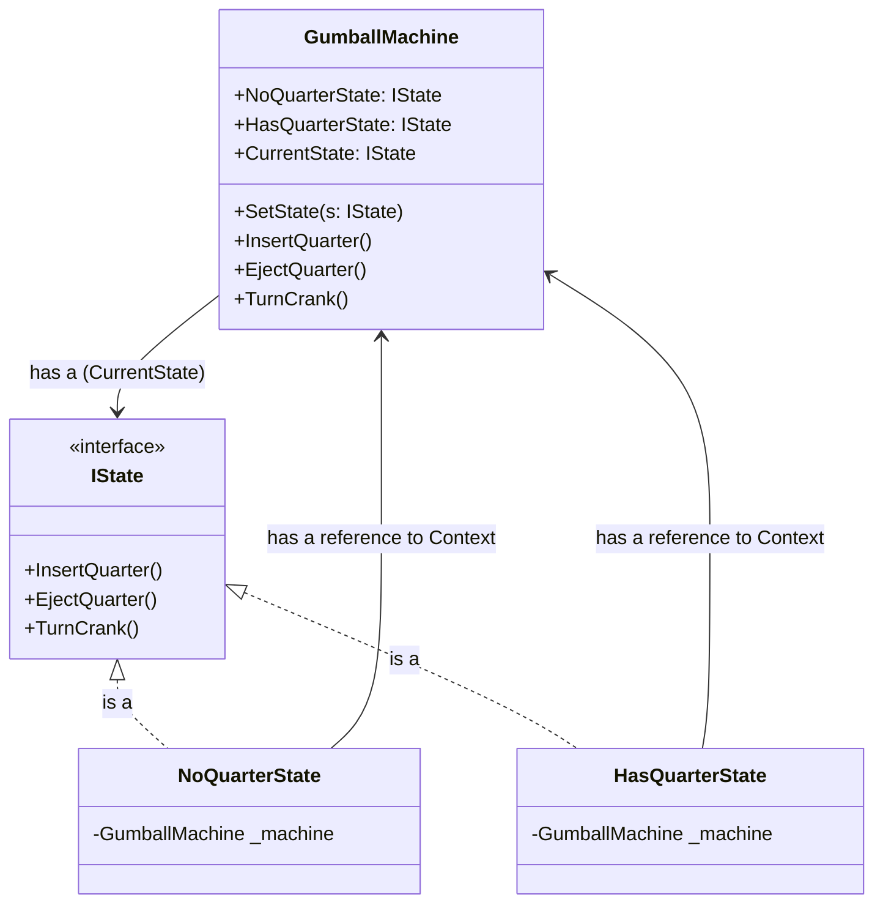
```mermaid
classDiagram
    class GumballMachine {
        +NoQuarterState: IState
        +HasQuarterState: IState
        +CurrentState: IState
        +SetState(s: IState)
        +InsertQuarter()
        +EjectQuarter()
        +TurnCrank()
    }
    class IState {
        <<interface>>
        +InsertQuarter()
        +EjectQuarter()
        +TurnCrank()
    }
    class NoQuarterState {
        -GumballMachine _machine
    }
    class HasQuarterState {
        -GumballMachine _machine
    }

    %% Relații "is a" (Realizări)
    IState <|.. NoQuarterState : is a
    IState <|.. HasQuarterState : is a

    %% Relații "has a" (Agregare bidirecțională / compoziție)
    GumballMachine --> IState : has a (CurrentState)
    NoQuarterState --> GumballMachine : has a reference to Context
    HasQuarterState --> GumballMachine : has a reference to Context
```

### 6. Explicația Codului și a Diagramei
* **Clasele utilizate:**
  * `GumballMachine` este **Contextul**.
  * `IState` este **Starea Abstractă**.
  * `NoQuarterState` și `HasQuarterState` sunt **Stările Concrete**.
* **Cum funcționează și ce evită:**
  * Contextul deține referințe către instanțele tuturor stărilor sale posibile și o referință către `CurrentState`. Metodele din context deleagă polimorfic apelurile către `CurrentState`. Clasele de stare conțin logica și schimbă starea contextului prin apelarea `SetState()`.
  * **Fără acest pattern:** Am fi avut o singură clasă `GumballMachine` cu metode mari pline de switch-uri greu de urmărit:
    ```csharp
    if (state == HAS_QUARTER) { ... } else if (state == NO_QUARTER) { ... }
    ```

---

## 3.5 Iterator (Iteratorul)

### 1. Definiție
**Iterator** oferă o cale de a accesa elementele unui obiect agregat în mod secvențial fără a expune reprezentarea sa internă.

### 2. Ce problemă rezolvă (Ce am folosi fără pattern)
Când avem două meniuri în restaurant, unul stocat ca `List<MenuItem>` și celălalt ca vector simplu `MenuItem[]`. Clientul vrea să le parcurgă uniform pentru a le afișa.
* **Codul fără pattern:** Clienții ar fi nevoiți să scrie două bucle `for` complet diferite pentru parcurgere.
* **Consecințe negative:** Codul client devine cuplat direct de structurile interne de date (liste, tablouri, arbori). Modificarea modului de stocare forțează rescrierea buclelor de afișare.

### 3. Avantaje și Dezavantaje (Simple)
* **Avantaje:**
  1. **Tratare uniformă:** Clientul parcurge colecțiile fără a ști dacă în spate e un tablou, o listă sau un tabel hash.
  2. **Interfețe curate:** Colecțiile nu mai au nevoie de metode de navigare internă, lăsând această grijă iteratorilor.
  3. **Navigări multiple simultane:** Putem rula mai mulți iteratori independenți în paralel pe aceeași colecție.
* **Dezavantaje:**
  1. **Complexitate nejustificată:** Pentru colecții simple (ex. doar liste liniare), utilizarea unui iterator adaugă clase în plus fără beneficii majore.
  2. **Latență suplimentară:** Accesul indirect prin metodele iteratorului (`HasNext`, `Next`) este mai lent decât accesul direct indexat.
  3. **Colecții dinamice periculoase:** Modificarea colecției în timp ce o iterăm poate genera erori de rulare imprevizibile.

### 4. Caz de implementare (Head First: Diner & Pancake House)
Implementăm parcurgerea uniformă a unui tablou fix și a unei liste.

```csharp
// --- INTERFAȚA ITERATOR ---
public interface IIterator
{
    bool HasNext();
    object Next();
}

// --- ITERATOR CONCRET (Pentru tablou fix) ---
public class ArrayIterator : IIterator
{
    private readonly string[] _items;
    private int _position = 0;

    public ArrayIterator(string[] items) => _items = items;

    public bool HasNext() => _position < _items.Length && _items[_position] != null;

    public object Next() => _items[_position++];
}

// --- COLECȚIA ---
public interface IAggregate
{
    IIterator CreateIterator();
}

public class DinerMenu : IAggregate
{
    private readonly string[] _menuItems = new string[3] { "Supa zilei", "Mici", "Desert" };

    public IIterator CreateIterator()
    {
        return new ArrayIterator(_menuItems); // Întoarce iteratorul specific
    }
}
```

### 5. Diagrama UML (Relații GoF)

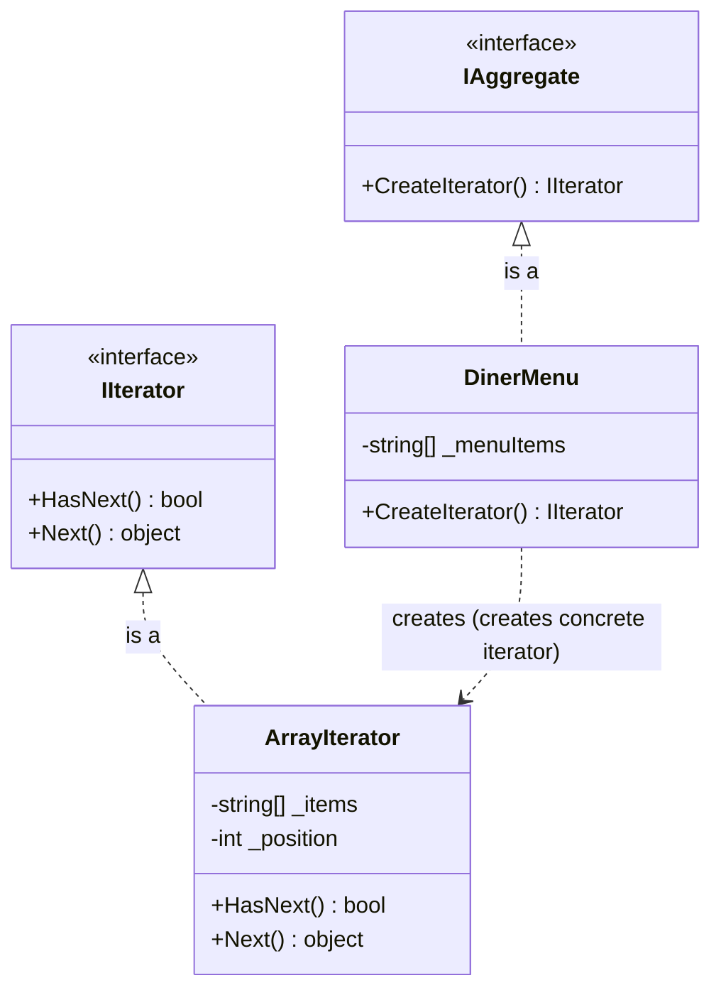
```mermaid
classDiagram
    class IAggregate {
        <<interface>>
        +CreateIterator() IIterator
    }
    class DinerMenu {
        -string[] _menuItems
        +CreateIterator() IIterator
    }
    class IIterator {
        <<interface>>
        +HasNext() bool
        +Next() object
    }
    class ArrayIterator {
        -string[] _items
        -int _position
        +HasNext() bool
        +Next() object
    }

    %% Relații "is a" (Realizări)
    IAggregate <|.. DinerMenu : is a
    IIterator <|.. ArrayIterator : is a

    %% Relații de dependență/creare
    DinerMenu ..> ArrayIterator : creates (creates concrete iterator)
```

### 6. Explicația Codului și a Diagramei
* **Clasele utilizate:**
  * `IAggregate` este interfața **Colecției**. `DinerMenu` este **Colecția Concretă**.
  * `IIterator` este **Iteratorul Abstract**. `ArrayIterator` este **Iteratorul Concret**.
* **Cum funcționează și ce evită:**
  * Clientul apelează `CreateIterator()` pe colecție, obținând un `IIterator`. Apoi apelează o buclă `while(iterator.HasNext())` pentru traversare. Nu se expune niciodată vectorul privat `_menuItems`.
  * **Fără acest pattern:** Clientul ar fi trebuit să acceseze vectorul direct din clasă:
    ```csharp
    for (int i = 0; i < menu.GetItems().Length; i++) { ... }
    ```
    Acest lucru forța expunerea tabloului în exterior, încălcând principiul încapsulării.

---

## 3.6 Mediator (Mediatorul)

### 1. Definiție
**Mediator** definește un obiect care încapsulează modul în care interacționează un set de obiecte. Promovează cuplajul slab, împiedicând obiectele să se refere explicit unele la altele, permițându-vă să variați interacțiunea lor în mod independent.

### 2. Ce problemă rezolvă (Ce am folosi fără pattern)
Când avem o cameră de chat sau o interfață cu multe butoane, liste și casete text care trebuie să se dezactiveze sau să se schimbe dinamic în funcție de ce selectează utilizatorul.
* **Codul fără pattern:** Fiecare control grafic ar trebui să dețină referințe la toate celelalte controale pentru a le schimba starea.
* **Consecințe negative:** O rețea impenetrabilă de conexiuni directe (cuplare completă). Modificarea unui singur buton generează erori în lanț în tot panoul.

### 3. Avantaje și Dezavantaje (Simple)
* **Avantaje:**
  1. **Reduce cuplajul:** Înlocuiește conexiunile complexe mulți-la-mulți cu conexiuni simple unu-la-mulți.
  2. **Centralizează controlul:** Logica de colaborare este izolată într-un singur punct central.
  3. **Componente reutilizabile:** Elementele individuale (butoanele) devin generice, neștiind nimic despre restul panoului.
* **Dezavantaje:**
  1. **Complexitatea Mediatorului:** Clasa Mediator devine rapid un "monolit" greu de gestionat și de depănat.
  2. **Punct unic de eșec (Single Point of Failure):** Dacă mediatorul are un bug, întregul flux de comunicație se prăbușește.
  3. **Indirecție suplimentară:** Toate mesajele sunt rutate printr-un intermediar, putând genera latențe logice.

### 4. Caz de implementare (Classic: Chat Room)
Colegii trimit mesaje prin intermediul camerei de chat, fără a se referi direct unul la celălalt.

```csharp
// --- MEDIATORUL ABSTRACT ---
public interface IChatMediator
{
    void SendMessage(string msg, User user);
    void AddUser(User user);
}

// --- COLEGUL (Colleague) ---
public abstract class User
{
    protected IChatMediator mediator;
    public string Name { get; }

    protected User(IChatMediator med, string name)
    {
        mediator = med;
        Name = name;
    }

    public abstract void Send(string message);
    public abstract void Receive(string message);
}

// --- MEDIATOR CONCRET ---
public class ChatRoom : IChatMediator
{
    private readonly List<User> _users = new();

    public void AddUser(User user) => _users.Add(user);

    public void SendMessage(string msg, User sender)
    {
        foreach (var u in _users)
        {
            // Trimit mesajul tuturor utilizatorilor exceptând expeditorul
            if (u != sender) u.Receive(msg);
        }
    }
}

// --- COLEG CONCRET ---
public class ConcreteUser : User
{
    public ConcreteUser(IChatMediator med, string name) : base(med, name) { }

    public override void Send(string message)
    {
        Console.WriteLine($"{Name} trimite: {message}");
        mediator.SendMessage(message, this); // Rutare prin Mediator
    }

    public override void Receive(string message)
    {
        Console.WriteLine($"{Name} a primit: {message}");
    }
}
```

### 5. Diagrama UML (Relații GoF)

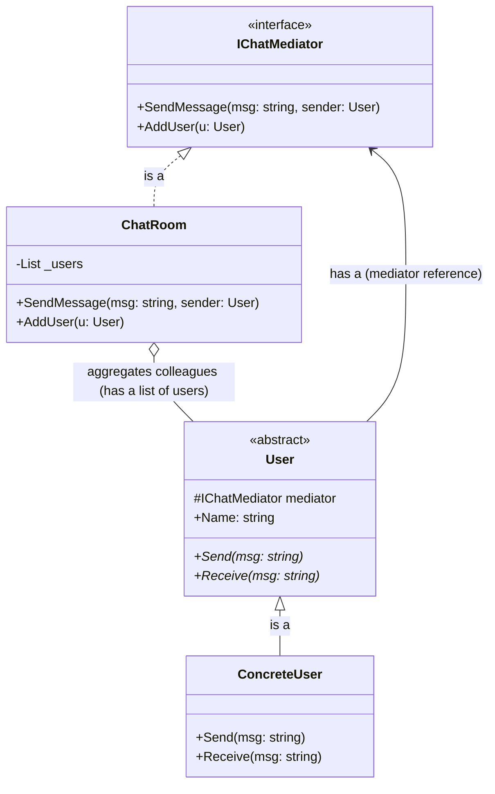
```mermaid
classDiagram
    class IChatMediator {
        <<interface>>
        +SendMessage(msg: string, sender: User)
        +AddUser(u: User)
    }
    class ChatRoom {
        -List _users
        +SendMessage(msg: string, sender: User)
        +AddUser(u: User)
    }
    class User {
        <<abstract>>
        #IChatMediator mediator
        +Name: string
        +Send(msg: string)*
        +Receive(msg: string)*
    }
    class ConcreteUser {
        +Send(msg: string)
        +Receive(msg: string)
    }

    %% Relații "is a" (Moșteniri/Realizări)
    IChatMediator <|.. ChatRoom : is a
    User <|-- ConcreteUser : is a

    %% Relații "has a" (Asocieri bidirecționale)
    User --> IChatMediator : has a (mediator reference)
    ChatRoom o-- User : aggregates colleagues (has a list of users)
```

### 6. Explicația Codului și a Diagramei
* **Clasele utilizate:**
  * `IChatMediator` și `ChatRoom` reprezintă **Mediatorul**.
  * `User` este **Colegul Abstract (Colleague)**, iar `ConcreteUser` este **Colegul Concret**.
* **Cum funcționează și ce evită:**
  * Când un utilizator vrea să transmită ceva, el nu apelează metode direct pe alți utilizatori. El trimite mesajul mediatorului: `mediator.SendMessage(...)`. Mediatorul centralizează lista de utilizatori și distribuie mesajul în siguranță.
  * **Fără acest pattern:** Fiecare instanță de `User` ar fi trebuit să aibă legături și referințe directe cu toate celelalte instanțe, creând o rețea de legături încurcate și greu de gestionat din punct de vedere al memoriei.

---

## 3.7 Chain of Responsibility (Lanțul de Responsabilitate)

### 1. Definiție
**Chain of Responsibility** evită cuplarea expeditorului unei cereri de receptorul acesteia, oferind mai multor obiecte șansa de a trata cererea. Lănțuiește obiectele receptoare și transmite cererea de-a lungul lanțului până când un obiect o tratează.

### 2. Ce problemă rezolvă (Ce am folosi fără pattern)
Când avem un sistem de asistență tehnică unde tichetele sunt filtrate succesiv în funcție de complexitate (Nivel 1 - Suport de bază, Nivel 2 - Tehnician, Nivel 3 - Administrator).
* **Codul fără pattern:** Am avea o singură clasă dispecer centrală plină de structuri de decizie:
  ```csharp
  if (ticket.IsSimple) ResolveBasic();
  else if (ticket.IsComplex) ResolveAdvanced();
  ```
* **Consecințe negative:** Cod extrem de rigid, greu de extins dacă vrem să introducem un nou nivel intermediar de aprobare.

### 3. Avantaje și Dezavantaje (Simple)
* **Avantaje:**
  1. **Decuplare ridicată:** Expeditorul cererii nu știe care verigă din lanț o va procesa în final.
  2. **Respectă principiul responsabilității unice:** Fiecare verigă se ocupă exclusiv de nișa ei de expertiză.
  3. **Configurare dinamică:** Putem ordona, adăuga sau elimina verigi din lanț direct la rulare.
* **Dezavantaje:**
  1. **Nicio garanție de tratare:** Dacă nicio verigă nu preia cererea, aceasta cade la capătul lanțului și este ignorată.
  2. **Performanță variabilă:** O cerere trimisă printr-un lanț foarte lung de elemente poate suferi întârzieri de rutare.
  3. **Depanare complicată:** Urmărirea parcursului unei cereri prin logica multor verigi poate fi anevoioasă.

### 4. Caz de implementare (Classic: Support Helpdesk)
Rulăm un lanț de suport care preia tichete de asistență.

```csharp
// --- TRATATORUL (Handler - Interfață / Clasă abstractă) ---
public abstract class SupportHandler
{
    protected SupportHandler successor; // Următoarea verigă (has a)

    public void SetSuccessor(SupportHandler next) => successor = next;

    public abstract void HandleRequest(int difficulty);
}

// --- TRATATORI CONCREȚI ---
public class Level1Support : SupportHandler
{
    public override void HandleRequest(int difficulty)
    {
        if (difficulty <= 1)
        {
            Console.WriteLine("Suport Nivel 1: Tichet rezolvat rapid!");
        }
        else if (successor != null)
        {
            successor.HandleRequest(difficulty); // Transmitere pe lanț
        }
    }
}

public class Level2Support : SupportHandler
{
    public override void HandleRequest(int difficulty)
    {
        if (difficulty <= 3)
        {
            Console.WriteLine("Suport Nivel 2 (Tehnician): Problemă soluționată.");
        }
        else if (successor != null)
        {
            successor.HandleRequest(difficulty);
        }
    }
}
```

### 5. Diagrama UML (Relații GoF)

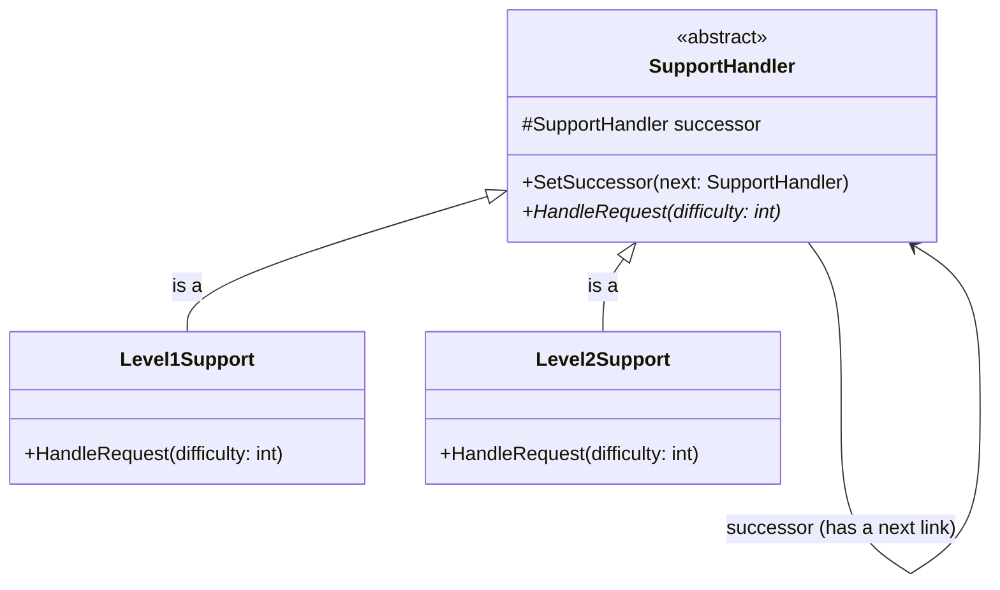
```mermaid
classDiagram
    class SupportHandler {
        <<abstract>>
        #SupportHandler successor
        +SetSuccessor(next: SupportHandler)
        +HandleRequest(difficulty: int)*
    }
    class Level1Support {
        +HandleRequest(difficulty: int)
    }
    class Level2Support {
        +HandleRequest(difficulty: int)
    }

    %% Relații "is a" (Moșteniri)
    SupportHandler <|-- Level1Support : is a
    SupportHandler <|-- Level2Support : is a

    %% Relația recursivă "has a" (Tratatorul conține o referință spre următorul tratator)
    SupportHandler --> SupportHandler : successor (has a next link)
```

### 6. Explicația Codului și a Diagramei
* **Clasele utilizate:**
  * `SupportHandler` definește contractul și reține pointerul către succesor.
  * `Level1Support` și `Level2Support` sunt **Tratatori Concreți**.
* **Cum funcționează și ce evită:**
  * Cererea intră prin prima verigă a lanțului. Dacă veriga nu are permisiuni, deleagă apelul către succesor (`successor.HandleRequest()`).
  * **Fără acest pattern:** Clientul trebuia să analizeze manual complexitatea tichetului înainte de a-l trimite și să decidă direct clasa pe care o apelează, generând cuplaj strâns.

---

## 3.8 Memento (Memento - Suvenirul)

### 1. Definiție
**Memento** capturează și exteriorizează starea internă a unui obiect, fără a-i încălca încapsularea, permițând restaurarea ulterioară a obiectului în această stare.

### 2. Ce problemă rezolvă (Ce am folosi fără pattern)
Când vrem să implementăm o funcționalitate de "Ctrl+Z" (Undo) în cadrul unui editor de text.
* **Codul fără pattern:** Clasa Caretaker (istoricul) ar trebui să citească starea editorului direct și să o stocheze în exterior.
* **Consecințe negative:** Încălcarea totală a încapsulării. Câmpurile interne private ale editorului ar trebui expuse ca publice pentru a putea fi citite și rescrise din exterior, distrugând securitatea datelor.

### 3. Avantaje și Dezavantaje (Simple)
* **Avantaje:**
  1. **Respectă încapsularea:** Obiectele își pot salva starea internă fără a-și expune detaliile sau structura private.
  2. **Cod curat pe Istoric:** Istoricul (Caretaker) doar depozitează mementourile fără a le manipula conținutul.
  3. **Restaurare simplă:** Oferă un mod sigur de recuperare a stărilor trecute.
* **Dezavantaje:**
  1. **Consum mare de RAM:** Salvarea frecventă a obiectelor mari în istoric poate epuiza memoria rapid.
  2. **Overhead de performanță:** Clonarea continuă a stărilor presupune consum de timp CPU.
  3. **Cicluri de viață greu de administrat:** Caretaker-ul trebuie să curețe mementourile vechi pentru a evita scurgerile de memorie.

### 4. Caz de implementare (Classic: Text Editor History)
Salvarea stării unui editor de text într-un Memento privat.

```csharp
// --- MEMENTO (Stochează starea de protejat) ---
public class EditorMemento
{
    public string Content { get; }

    public EditorMemento(string content) => Content = content;
}

// --- ORIGINATOR (Cel a cărui stare vrem să o salvăm) ---
public class TextEditor
{
    public string Content { get; set; } = "";

    // Creează un suvenir cu starea curentă
    public EditorMemento Save() => new EditorMemento(Content);

    // Restaurează starea dintr-un suvenir
    public void Restore(EditorMemento memento)
    {
        if (memento != null) Content = memento.Content;
    }
}

// --- CARETAKER (Istoricul - Păstrătorul de mementouri) ---
public class HistoryCaretaker
{
    private readonly Stack<EditorMemento> _history = new();

    public void Push(EditorMemento memento) => _history.Push(memento);

    public EditorMemento Pop() => _history.Count > 0 ? _history.Pop() : null;
}
```

### 5. Diagrama UML (Relații GoF)

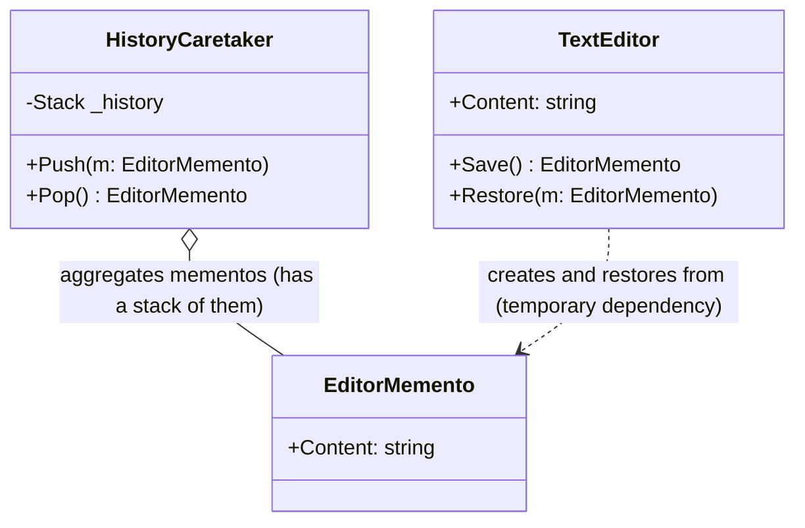
```mermaid
classDiagram
    class EditorMemento {
        +Content: string
    }
    class TextEditor {
        +Content: string
        +Save() EditorMemento
        +Restore(m: EditorMemento)
    }
    class HistoryCaretaker {
        -Stack _history
        +Push(m: EditorMemento)
        +Pop() EditorMemento
    }

    %% Relații de asociere/dependență ("has a")
    HistoryCaretaker o-- EditorMemento : aggregates mementos (has a stack of them)
    TextEditor ..> EditorMemento : creates and restores from (temporary dependency)
```

### 6. Explicația Codului și a Diagramei
* **Clasele utilizate:**
  * `TextEditor` este **Originatorul**. Conține starea activă.
  * `EditorMemento` este **Memento-ul**. Stochează starea într-un mod imutabil.
  * `HistoryCaretaker` este **Caretaker-ul (Păstrătorul)**. Conține stiva de istoric.
* **Cum funcționează și ce evită:**
  * `HistoryCaretaker` apelează `editor.Save()`, obținând memento-ul pe care îl depozitează. El nu citește și nu poate modifica valoarea conținutului din memento. La nevoie, îl returnează editorului apelând `editor.Restore()`.
  * **Fără acest pattern:** Caretaker-ul ar fi trebuit să preia string-ul direct și să-l salveze local. Dacă datele din editor erau mai complexe (ex. obiecte de tip cursor, formatări), ar fi trebuit să le stocheze pe toate în exterior, spărgând barierele de protecție ale clasei.

---

## 3.9 Visitor (Vizitatorul)

### 1. Definiție
**Visitor** reprezintă o operație care trebuie efectuată pe elementele unei structuri de obiecte. Vă permite să definiți o nouă operație fără a modifica clasele elementelor pe care operează.

### 2. Ce problemă rezolvă (Ce am folosi fără pattern)
Când avem o structură fixă de obiecte (ex. elementele unui coș de cumpărături: Cărți, Fructe) și vrem să aplicăm diverse operații pe ele (ex. calcul taxă, generare raport text).
* **Codul fără pattern:** Ar trebui să mergem în fiecare clasă concretă (`Book`, `Fruit`) și să adăugăm o metodă `CalculateTax()`.
* **Consecințe negative:** Încălcarea principiului Open-Closed. De fiecare dată când vrem să adăugăm o operație nouă (ex: `ExportToXml()`), trebuie să refactorizăm toate clasele de produse din proiect.

### 3. Avantaje și Dezavantaje (Simple)
* **Avantaje:**
  1. **Respectă principiul Open-Closed (OCP):** Putem adăuga oricâte operații noi prin crearea de noi vizitatori, fără a altera elementele.
  2. **Grupează comportamente corelate:** Logica de calcul a taxelor este centralizată în vizitator, nu împrăștiată în produse.
  3. **Vizitează structuri diverse:** Poate parcurge elemente cu interfețe total diferite (spre deosebire de Iterator).
* **Dezavantaje:**
  1. **Rigiditate la elemente noi:** Dacă adăugăm un nou tip de element (ex: `Toy`), trebuie să modificăm interfața vizitatorului și toate clasele sale concrete derivate.
  2. **Încalcă încapsularea:** Vizitatorul are nevoie de acces public la datele interne ale elementelor pentru a-și efectua operațiunile.
  3. **Mecanismul Double Dispatch:** Rularea apelurilor prin `Accept()` și `Visit()` poate fi extrem de confuză la depanare.

### 4. Caz de implementare (Classic: Shopping Cart Tax Visitor)
Adăugăm un vizitator de calculare taxe peste elemente de coș cumpărături.

```csharp
// --- VIZITATORUL ABSTRACT ---
public interface IShoppingCartVisitor
{
    decimal Visit(Book book);
    decimal Visit(Fruit fruit);
}

// --- ELEMENTUL ABSTRACT ---
public interface IElement
{
    decimal Accept(IShoppingCartVisitor visitor); // Double Dispatch
}

// --- ELEMENTE CONCRETE ---
public class Book : IElement
{
    public decimal Price { get; }
    public Book(decimal price) => Price = price;

    public decimal Accept(IShoppingCartVisitor visitor)
    {
        return visitor.Visit(this); // Întoarcere apel către Vizitator
    }
}

public class Fruit : IElement
{
    public decimal Weight { get; }
    public decimal PricePerKg { get; }

    public Fruit(decimal weight, decimal pricePerKg)
    {
        Weight = weight;
        PricePerKg = pricePerKg;
    }

    public decimal Accept(IShoppingCartVisitor visitor)
    {
        return visitor.Visit(this);
    }
}

// --- VIZITATOR CONCRET (Calculator Taxe) ---
public class TaxVisitor : IShoppingCartVisitor
{
    public decimal Visit(Book book)
    {
        // Cărțile au TVA redus de 5%
        return book.Price * 0.05m;
    }

    public decimal Visit(Fruit fruit)
    {
        // Fructele au TVA de 9%
        return (fruit.Weight * fruit.PricePerKg) * 0.09m;
    }
}
```

### 5. Diagrama UML (Relații GoF)

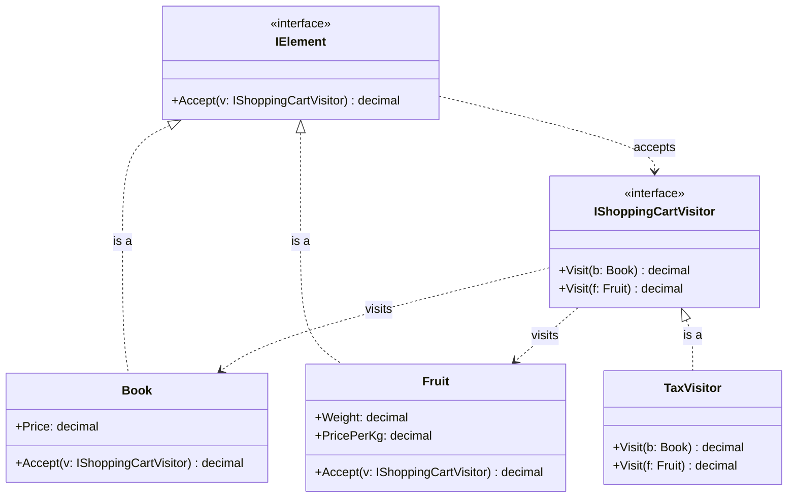
```mermaid
classDiagram
    class IShoppingCartVisitor {
        <<interface>>
        +Visit(b: Book) decimal
        +Visit(f: Fruit) decimal
    }
    class TaxVisitor {
        +Visit(b: Book) decimal
        +Visit(f: Fruit) decimal
    }
    class IElement {
        <<interface>>
        +Accept(v: IShoppingCartVisitor) decimal
    }
    class Book {
        +Price: decimal
        +Accept(v: IShoppingCartVisitor) decimal
    }
    class Fruit {
        +Weight: decimal
        +PricePerKg: decimal
        +Accept(v: IShoppingCartVisitor) decimal
    }

    %% Relații "is a" (Realizări)
    IShoppingCartVisitor <|.. TaxVisitor : is a
    IElement <|.. Book : is a
    IElement <|.. Fruit : is a

    %% Relații de dependență încrucișată (Double Dispatch - "has a temporary dependency")
    IElement ..> IShoppingCartVisitor : accepts
    IShoppingCartVisitor ..> Book : visits
    IShoppingCartVisitor ..> Fruit : visits
```

### 6. Explicația Codului și a Diagramei
* **Clasele utilizate:**
  * `IShoppingCartVisitor` și `TaxVisitor` reprezintă **Vizitatorul**.
  * `IElement` este **Elementul Abstract**. `Book` și `Fruit` sunt **Elemente Concrete**.
* **Cum funcționează și ce evită:**
  * Relația de legătură folosește tehnica numită **Double Dispatch**. Când apelăm `element.Accept(visitor)`, elementul execută `visitor.Visit(this)`. Clasa elementului rezolvă polimorfismul la rulare și direcționează apelul către metoda exactă din vizitator care îi corespunde.
  * **Fără acest pattern:** Pentru a calcula taxele, ar fi trebuit să adăugăm cod de calcul separat în fiecare din clasele de produse concrete sau să folosim structuri masive de `if (item is Book) { ... }` în clasa principală, încălcând OCP.

---
